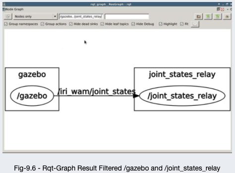

# Travail de Bachelor

Auteur : Eloïse Martin

Bureau : A12, Route de Cheseaux 1

## 26.02.2021

But : Déplacement autonome en extérieur, Agribot

Rendu : 
- 13.07.2021 : Rapport intermédiaire

Challenge : obtenir une précision proche du centimètre, cartographier le champs en utilisant les coordonées

Dispotition du champs : bandes de 100-150 mètres

Objectifs : 
- Agribot doit pouvoir se retrouver dans le champs cartographier
- Agribot doit répondre à des commandes prédéfinies (aller chercher de l'eau, aller arroser la bande X)

ROS : 
- paquet de navigation

TODO :
- Définir quels capteurs GPS utiliser (RTK)
- Contacter Sébastien Guillaume, INCIT, Géomatique
- Déterminer les différentes probblématiques du contexte de déplacement en extérieur (mise en situation, moyen de communication, SMS, Carte SIM, alarme de sécurité, ...)
- Prise en main de ROS
- Prise en main de la RPI4
- Journal de travail (notes, nombre d'heures, mesures, PV pour les séances, ...)


## 08.03.2021 - Gabriel


TODO : 
- Installer Ubuntu en dual boot sur MBAir et sur iMac et sur Dell de la salle A12


## 17.03.2021


Nombre d'heure à rattraper : ~13h


## 18.03.2021


- Télécharger le repo ROS et parcourir le contenu
- Lire doc ROS
- Suivre quelques cours sur the constructsim, attention -> login valable jusqu'au 11.04 13h
- Déterminer les étapes du projet dans le but d'établir un planning


## 10.04.2021 - Cours en ligne

Cours ROS Neotic en Python du site app.theconstructsim.com

Exemple de code qui fait tourner le robot :

```py
#! /usr/bin/env python

import rospy
from geometry_msgs.msg import Twist

rospy.init_node("stop_node")
my_publisher = rospy.Publisher("/cmd_vel", Twist, queue_size=1)
my_rate = rospy.Rate(2)
my_move = Twist()
my_move.linear.x = 0.5
my_move.angular.x = 0.5

while not rospy.is_shutdown():
    my_publisher.publish(my_move)
    my_rate.sleep()
```

 Premier exemple de ROS Deconstruction.

 Ci-dessous, le code qui permet au robot de s'arreter.

```py
#! /usr/bin/env python

import rospy
from geometry_msgs.msg import Twist

rospy.init_node("stop_node")
my_publisher = rospy.Publisher("/cmd_vel", Twist, queue_size=1)
my_rate = rospy.Rate(2)
my_move = Twist()
my_move.linear.x = 0
my_move.angular.x = 0

while not rospy.is_shutdown():
    my_publisher.publish(my_move)
```

Pour exécuter ces codes, les commandes suivantes ont été utilisées :

```bash
roslaunch publisher_example move.launch
roslaunch publisher_exemple stop.launch
```

To use a service, launch the server :

```bash
roslaunch service_demo service_launch.launch
```

And from the client :

```bash
rosservice call /service_demo "{}"
```

The file service code contains the following code :

```py
#! /usr/bin/env python

import rospy
from std_srvs.srv import Empty, EmptyResponse # you import the service message python classes generated from Empty.srv.
from geometry_msgs.msg import Twist


def my_callback(request):

    pub = rospy.Publisher('/cmd_vel', Twist, queue_size=1)
    rate = rospy.Rate(1)
    move = Twist()
    move.linear.x = 0.5
    move.angular.z = 1
    for i in range(4):
        pub.publish(move)
        rate.sleep()

    move.linear.x = 0
    move.angular.z = 0
    pub.publish(move)

    return EmptyResponse() # the service Response class, in this case EmptyResponse
    #return MyServiceResponse(len(request.words.split()))

rospy.init_node('service_test_node')
my_service = rospy.Service('/service_demo', Empty , my_callback) # create the Service called my_service with the defined callback
rospy.spin() # mantain the service open
```

To start an action, start the server :

```bash
roslaunch action_demo action_launch.launch
```

And from the client :

```bash
roslaunch action_demo_client client_launch.launch
```

Ci-dessous, le code du server de l'action :

```py
#! /usr/bin/env python
import rospy

import actionlib

from actionlib.msg import TestFeedback, TestResult, TestAction
from geometry_msgs.msg import Twist

class MoveClass(object):

  # create messages that are used to publish feedback/result
  _feedback = TestFeedback()
  _result   = TestResult()

  def __init__(self):
    # creates the action server
    self._as = actionlib.SimpleActionServer("action_demo", TestAction, self.goal_callback, False)
    self._as.start()

  def goal_callback(self, goal):
    # this callback is called when the action server is called.
    # this is the function that computes the Fibonacci sequence
    # and returns the sequence to the node that called the action server

    # helper variables
    r = rospy.Rate(1)
    success = True

    # append the seeds for the fibonacci sequence
    #self._feedback.sequence = []
    #self._feedback.sequence.append(0)
    #self._feedback.sequence.append(1)

    # publish info to the console for the user
    #rospy.loginfo('"fibonacci_as": Executing, creating fibonacci sequence of order %i with seeds %i, %i' % ( goal.order, self._feedback.sequence[0], self._feedback.sequence[1]))

    # starts calculating the Fibonacci sequence
    pub = rospy.Publisher('/cmd_vel', Twist, queue_size=1)
    move = Twist()
    move.linear.x = 0.5
    move.angular.z = 1
    seconds = goal.goal
    for i in range(seconds):

      # check that preempt (cancelation) has not been requested by the action client
      if self._as.is_preempt_requested():
        rospy.loginfo('The goal has been cancelled/preempted')
        # the following line, sets the client in preempted state (goal cancelled)
        self._as.set_preempted()
        success = False
        # we end the calculation of the Fibonacci sequence
        break

      # builds the next feedback msg to be sent
      #self._feedback.sequence.append(self._feedback.sequence[i] + self._feedback.sequence[i-1])
      # publish the feedback
      #self._as.publish_feedback(self._feedback)
      # the sequence is computed at 1 Hz frequency
      pub.publish(move)
      r.sleep()

    move.linear.x = 0
    move.angular.z = 0
    pub.publish(move)
    # at this point, either the goal has been achieved (success==true)
    # or the client preempted the goal (success==false)
    # If success, then we publish the final result
    # If not success, we do not publish anything in the result
    if success:
      #self._result.sequence = self._feedback.sequence
      #rospy.loginfo('Succeeded calculating the Fibonacci of order %i' % fibonacciOrder )
      self._as.set_succeeded(self._result)

if __name__ == '__main__':
  rospy.init_node('action_test_node')
  MoveClass()
  rospy.spin()
```

Ci-dessous, le code de l'action pour le client :

```py
#! /usr/bin/env python
import rospy
import time
import actionlib
from actionlib.msg import TestAction, TestGoal, TestResult, TestFeedback


# definition of the feedback callback. This will be called when feedback
# is received from the action server
# it just prints a message indicating a new message has been received
def feedback_callback(feedback):

    print('[Feedback] Executing Action')


# initializes the action client node
rospy.init_node('action_client_node')

# create the connection to the action server
client = actionlib.SimpleActionClient('/action_demo', TestAction)
# waits until the action server is up and running
client.wait_for_server()

# creates a goal to send to the action server
goal = TestGoal()
goal.goal = 5 # indicates, take pictures along 10 seconds

# sends the goal to the action server, specifying which feedback function
# to call when feedback received
client.send_goal(goal, feedback_cb=feedback_callback)

# Uncomment these lines to test goal preemption:
#time.sleep(3.0)
#client.cancel_goal()  # would cancel the goal 3 seconds after starting

# wait until the result is obtained
# you can do other stuff here instead of waiting
# and check for status from time to time
# status = client.get_state()
# check the client API link below for more info

client.wait_for_result()

print('[Result] State: %d'%(client.get_state()))
```

Ci-dessous, la commande pour commander le robot via le clavier :

```bash
roslaunch turtlebot_teleop keyboard_teleop.launch
```

Notes : pour tourner sans avancer : `j` (gauche) et `l` (droite), pour tourner à gauche en avançant `u` et pour tourner à droite en avançant `o`, `i` permet d'avancer tout droit, `m` permet de reculer vers la gauche et `.` permet de reculer vers la droite. `,` permet de reculer tout droit.

Ci-dessous, le code python qui permet ce topic :

```py
#!/usr/bin/env python

# Copyright (c) 2011, Willow Garage, Inc.
# All rights reserved.
#
# Redistribution and use in source and binary forms, with or without
# modification, are permitted provided that the following conditions are met:
#
#    * Redistributions of source code must retain the above copyright
#      notice, this list of conditions and the following disclaimer.
#    * Redistributions in binary form must reproduce the above copyright
#      notice, this list of conditions and the following disclaimer in the
#      documentation and/or other materials provided with the distribution.
#    * Neither the name of the Willow Garage, Inc. nor the names of its
#      contributors may be used to endorse or promote products derived from
#       this software without specific prior written permission.
#
# THIS SOFTWARE IS PROVIDED BY THE COPYRIGHT HOLDERS AND CONTRIBUTORS "AS IS"
# AND ANY EXPRESS OR IMPLIED WARRANTIES, INCLUDING, BUT NOT LIMITED TO, THE
# IMPLIED WARRANTIES OF MERCHANTABILITY AND FITNESS FOR A PARTICULAR PURPOSE
# ARE DISCLAIMED. IN NO EVENT SHALL THE COPYRIGHT OWNER OR CONTRIBUTORS BE
# LIABLE FOR ANY DIRECT, INDIRECT, INCIDENTAL, SPECIAL, EXEMPLARY, OR
# CONSEQUENTIAL DAMAGES (INCLUDING, BUT NOT LIMITED TO, PROCUREMENT OF
# SUBSTITUTE GOODS OR SERVICES; LOSS OF USE, DATA, OR PROFITS; OR BUSINESS
# INTERRUPTION) HOWEVER CAUSED AND ON ANY THEORY OF LIABILITY, WHETHER IN
# CONTRACT, STRICT LIABILITY, OR TORT (INCLUDING NEGLIGENCE OR OTHERWISE)
# ARISING IN ANY WAY OUT OF THE USE OF THIS SOFTWARE, EVEN IF ADVISED OF THE
# POSSIBILITY OF SUCH DAMAGE.

import rospy

from geometry_msgs.msg import Twist

import sys, select, termios, tty

msg = """
Control Your Turtlebot!
---------------------------
Moving around:
   u    i    o
   j    k    l
   m    ,    .

q/z : increase/decrease max speeds by 10%
w/x : increase/decrease only linear speed by 10%
e/c : increase/decrease only angular speed by 10%
space key, k : force stop
anything else : stop smoothly

CTRL-C to quit
"""

moveBindings = {
        'i':(1,0),
        'o':(1,-1),
        'j':(0,1),
        'l':(0,-1),
        'u':(1,1),
        ',':(-1,0),
        '.':(-1,1),
        'm':(-1,-1),
           }

speedBindings={
        'q':(1.1,1.1),
        'z':(.9,.9),
        'w':(1.1,1),
        'x':(.9,1),
        'e':(1,1.1),
        'c':(1,.9),
          }

def getKey():
    tty.setraw(sys.stdin.fileno())
    rlist, _, _ = select.select([sys.stdin], [], [], 0.1)
    if rlist:
        key = sys.stdin.read(1)
    else:
        key = ''

    termios.tcsetattr(sys.stdin, termios.TCSADRAIN, settings)
    return key

speed = .2
turn = 1

def vels(speed,turn):
    return "currently:\tspeed %s\tturn %s " % (speed,turn)

if __name__=="__main__":
    settings = termios.tcgetattr(sys.stdin)

    rospy.init_node('turtlebot_teleop')
    pub = rospy.Publisher('~cmd_vel', Twist, queue_size=5)

    x = 0
    th = 0
    status = 0
    count = 0
    acc = 0.1
    target_speed = 0
    target_turn = 0
    control_speed = 0
    control_turn = 0
    try:
        print(msg)
        print(vels(speed,turn))
        while(1):
            key = getKey()
            if key in moveBindings.keys():
                x = moveBindings[key][0]
                th = moveBindings[key][1]
                count = 0
            elif key in speedBindings.keys():
                speed = speed * speedBindings[key][0]
                turn = turn * speedBindings[key][1]
                count = 0

                print(vels(speed,turn))
                if (status == 14):
                    print(msg)
                status = (status + 1) % 15
            elif key == ' ' or key == 'k' :
                x = 0
                th = 0
                control_speed = 0
                control_turn = 0
            else:
                count = count + 1
                if count > 4:
                    x = 0
                    th = 0
                if (key == '\x03'):
                    break

            target_speed = speed * x
            target_turn = turn * th

            if target_speed > control_speed:
                control_speed = min( target_speed, control_speed + 0.02 )
            elif target_speed < control_speed:
                control_speed = max( target_speed, control_speed - 0.02 )
            else:
                control_speed = target_speed

            if target_turn > control_turn:
                control_turn = min( target_turn, control_turn + 0.1 )
            elif target_turn < control_turn:
                control_turn = max( target_turn, control_turn - 0.1 )
            else:
                control_turn = target_turn

            twist = Twist()
            twist.linear.x = control_speed; twist.linear.y = 0; twist.linear.z = 0
            twist.angular.x = 0; twist.angular.y = 0; twist.angular.z = control_turn
            pub.publish(twist)

            #print("loop: {0}".format(count))
            #print("target: vx: {0}, wz: {1}".format(target_speed, target_turn))
            #print("publihsed: vx: {0}, wz: {1}".format(twist.linear.x, twist.angular.z))

    except Exception as e:
        print(e)

    finally:
        twist = Twist()
        twist.linear.x = 0; twist.linear.y = 0; twist.linear.z = 0
        twist.angular.x = 0; twist.angular.y = 0; twist.angular.z = 0
        pub.publish(twist)

    termios.tcsetattr(sys.stdin, termios.TCSADRAIN, settings)
```

Ainsi que le code c++ :

```cpp
/*
 * Copyright (c) 2010, Willow Garage, Inc.
 * All rights reserved.
 *
 * Redistribution and use in source and binary forms, with or without
 * modification, are permitted provided that the following conditions are met:
 *
 *     * Redistributions of source code must retain the above copyright
 *       notice, this list of conditions and the following disclaimer.
 *     * Redistributions in binary form must reproduce the above copyright
 *       notice, this list of conditions and the following disclaimer in the
 *       documentation and/or other materials provided with the distribution.
 *     * Neither the name of the Willow Garage, Inc. nor the names of its
 *       contributors may be used to endorse or promote products derived from
 *       this software without specific prior written permission.
 *
 * THIS SOFTWARE IS PROVIDED BY THE COPYRIGHT HOLDERS AND CONTRIBUTORS "AS IS"
 * AND ANY EXPRESS OR IMPLIED WARRANTIES, INCLUDING, BUT NOT LIMITED TO, THE
 * IMPLIED WARRANTIES OF MERCHANTABILITY AND FITNESS FOR A PARTICULAR PURPOSE
 * ARE DISCLAIMED. IN NO EVENT SHALL THE COPYRIGHT OWNER OR CONTRIBUTORS BE
 * LIABLE FOR ANY DIRECT, INDIRECT, INCIDENTAL, SPECIAL, EXEMPLARY, OR
 * CONSEQUENTIAL DAMAGES (INCLUDING, BUT NOT LIMITED TO, PROCUREMENT OF
 * SUBSTITUTE GOODS OR SERVICES; LOSS OF USE, DATA, OR PROFITS; OR BUSINESS
 * INTERRUPTION) HOWEVER CAUSED AND ON ANY THEORY OF LIABILITY, WHETHER IN
 * CONTRACT, STRICT LIABILITY, OR TORT (INCLUDING NEGLIGENCE OR OTHERWISE)
 * ARISING IN ANY WAY OUT OF THE USE OF THIS SOFTWARE, EVEN IF ADVISED OF THE
 * POSSIBILITY OF SUCH DAMAGE.
 */

#include <ros/ros.h>
#include <geometry_msgs/Twist.h>
#include <sensor_msgs/Joy.h>
#include "boost/thread/mutex.hpp"
#include "boost/thread/thread.hpp"
#include "ros/console.h"

class TurtlebotTeleop
{
public:
  TurtlebotTeleop();

private:
  void joyCallback(const sensor_msgs::Joy::ConstPtr& joy);
  void publish();

  ros::NodeHandle ph_, nh_;

  int linear_, angular_, deadman_axis_;
  double l_scale_, a_scale_;
  ros::Publisher vel_pub_;
  ros::Subscriber joy_sub_;

  geometry_msgs::Twist last_published_;
  boost::mutex publish_mutex_;
  bool deadman_pressed_;
  bool zero_twist_published_;
  ros::Timer timer_;

};

TurtlebotTeleop::TurtlebotTeleop():
  ph_("~"),
  linear_(1),
  angular_(0),
  deadman_axis_(4),
  l_scale_(0.3),
  a_scale_(0.9)
{
  ph_.param("axis_linear", linear_, linear_);
  ph_.param("axis_angular", angular_, angular_);
  ph_.param("axis_deadman", deadman_axis_, deadman_axis_);
  ph_.param("scale_angular", a_scale_, a_scale_);
  ph_.param("scale_linear", l_scale_, l_scale_);

  deadman_pressed_ = false;
  zero_twist_published_ = false;

  vel_pub_ = ph_.advertise<geometry_msgs::Twist>("cmd_vel", 1, true);
  joy_sub_ = nh_.subscribe<sensor_msgs::Joy>("joy", 10, &TurtlebotTeleop::joyCallback, this);

  timer_ = nh_.createTimer(ros::Duration(0.1), boost::bind(&TurtlebotTeleop::publish, this));
}

void TurtlebotTeleop::joyCallback(const sensor_msgs::Joy::ConstPtr& joy)
{
  geometry_msgs::Twist vel;
  vel.angular.z = a_scale_*joy->axes[angular_];
  vel.linear.x = l_scale_*joy->axes[linear_];
  last_published_ = vel;
  deadman_pressed_ = joy->buttons[deadman_axis_];
}

void TurtlebotTeleop::publish()
{
  boost::mutex::scoped_lock lock(publish_mutex_);

  if (deadman_pressed_)
  {
    vel_pub_.publish(last_published_);
    zero_twist_published_=false;
  }
  else if(!deadman_pressed_ && !zero_twist_published_)
  {
    vel_pub_.publish(*new geometry_msgs::Twist());
    zero_twist_published_=true;
  }
}

int main(int argc, char** argv)
{
  ros::init(argc, argv, "turtlebot_teleop");
  TurtlebotTeleop turtlebot_teleop;

  ros::spin();
}
```


La commande `roslaunch <package_name> <launch_file>` permet de lancer un programme ROS.

ROS utilise les packages pour organiser le code, les programmes. Un package contient tous les fichiers nécessaires au bon fonctionnement du programme (.py, .cpp, .md, Makifle, fichiers de paramètres, ...)

Exemple :
- launch : contient des fichier de launch
- src : contient les fichiers sources (cpp, python)
- CMakeLists.txt : Une liste de règles cmake pour la compilation
- package.xml : information du package et des dépendances

Pour accéder à n'importe quel package ROS, la commande `roscd` permet d'accéder au contenu du package, exemple :

```bash
~ $ roscd turtlebot_teleop
/home/simulations/public_sim_ws/src/all/turtlebot/turtlebot_teleop $ 
```

Exemple de fichier launch :

```xml
<launch>
  <!-- turtlebot_teleop_key already has its own built in velocity smoother -->
  <node pkg="turtlebot_teleop" type="turtlebot_teleop_key.py" name="turtlebot_teleop_keyboard" output="screen">
    <param name="scale_linear" value="0.5" type="double"/>
    <param name="scale_angular" value="1.5" type="double"/>
    <remap from="turtlebot_teleop_keyboard/cmd_vel" to="/cmd_vel"/>   <!-- cmd_vel_mux/input/teleop"/-->
  </node>
</launch>
```

- pkg correspond au nom du package qui contient le code du programme ROS a exécuté.
- type correspond au nom du fichier que l'on souhaite exécuter
- name corrempond au nom du noeud ROS qui va appeler le code dans le fichier enregistré sous type
- output correspond àla sortie utiliser pour les affichages du code

Exemple de fichier package.xml : 

```xml
<package>
  <name>turtlebot_teleop</name>
  <version>2.3.11</version>
  <description>Provides teleoperation using joysticks or keyboard.</description>
  <maintainer email="mwise@willowgarage.com">Melonee Wise</maintainer>
  <license>BSD</license>
  <url type="website">http://ros.org/wiki/turtlebot_teleop</url>
  <url type="repository">https://github.com/turtlebot/turtlebot</url>
  <url type="bugtracker">https://github.com/turtlebot/turtlebot/issues</url>

  <author email="mwise@willowgarage.com">Melonee Wise</author>

  <buildtool_depend>catkin</buildtool_depend>

  <build_depend>roscpp</build_depend>
  <build_depend>geometry_msgs</build_depend>
  <build_depend>joy</build_depend>

  <run_depend>roscpp</run_depend>
  <run_depend>geometry_msgs</run_depend>
  <run_depend>joy</run_depend>
  <run_depend>kobuki_safety_controller</run_depend>
  <run_depend>yocs_velocity_smoother</run_depend>
  <run_depend>turtlebot_bringup</run_depend>
</package>
```


### catkin workspace

Il ccontient :
- build : les fichiers utiles pour le code cpp
- devel : les fichiers utiles pour le code python
- src : les nouveaux packages créés

Pour créer un nouveau package ROS, utiliser le répertoire `catkin_ws/src` :

```bash
~/catkin_ws/src $ catkin_create_pkg my_package rospy
Created file my_package/package.xml
Created file my_package/CMakeLists.txt
Created folder my_package/src
Successfully created files in /home/user/catkin_ws/src/my_package. Please adjust the values in package.xml.
```

La commande est la suivante `catkin_create_pkg <package_name> <package_dependencies>`. The package_dependencies must be ROS packages.

Pour mettre à jour la bibliothèque de package ROS utiliser la commande suivante :

```bash
rospack profile
```

Premier code ultra simple avec rappels :

```py
#! /usr/bin/env python 
# This line will ensure the interpreter used is the first one on your environment's $PATH. Every Python file needs
# to start with this line at the top.

import rospy # Import the rospy, which is a Python library for ROS.

rospy.init_node('ObiWan') # Initiate a node called ObiWan

print("Help me Obi-Wan Kenobi, you're my only hope") # A simple Python print
```


### ROS Nodes

Ce sont des programmes ROS, les nodes actifs sont visibles avec la commande :

```bash
rosnode list
```

Le code d'avant avec quelques modifications :

```py
#! /usr/bin/env python

import rospy

rospy.init_node("ObiWan")
rate = rospy.Rate(2)               # We create a Rate object of 2Hz
while not rospy.is_shutdown():     # Endless loop until Ctrl + C
   print("Help me Obi-Wan Kenobi, you're my only hope")
   rate.sleep()                    # We sleep the needed time to maintain the Rate fixed above
    
# This program creates an endless loop that repeats itself 2 times per second (2Hz) until somebody presses Ctrl + C
# in the Shell
```

Il est également possible d'obtenir des informations sur le node en activité avec la commande `rosnode info <my_node>`, exemple :

```bash
rosnode info ObiWan
```


### Compile a package

Pour compiler tous les packages (important de le faire à la racine de catkin_ws) :

```bash
~/catkin_ws $ catkin_make
```

Après la compilation il est important de mettre à jour  ROS pour qu'il aie les derniers changements :

```bash
source devel/setup.sh
```

Pour ne pas tout compiler, il est possible d'utiliser le paramètre `--only-pkg-with-deps <package_name>`.

Il est également possible de compiler en utilisant la commande suivante depuis la racine catkin :

```bash
catkin build
source devel/setup.bash
```

Pour compiler seulement le package souhaité : `catkin build <package_name>`


### Paramètres serveur

Un paramètre serveur est un dictionnaire que ROS utilise pour stocker les paramètres. Ces paramètres peuvent être utilisé par les noeuds (nodes) en cours d'exécution, généralement utilisés pour stocker des données statiques (configuration...).

La commande suivante permet de lister cela : `rosparam list`

Pour connaître la valeur d'un paramètre spécifique, il suffit de lancer `rosparam get <parameter_name>`.
Pour mettre à jour il suffit de remplcaer le `get` par `set`.


### ROS Core

`roscore` est le processus principal qui permet de gérer tout le système ROS. La commande `roscore` permet de lancer le système.


### Variables d'environnement ROS

Avec la commande `export | grep ROS` on peut voir quelles variables sont utilisées pour ROS, voici le résultat :

```bash
user ~ $ export | grep ROS
declare -x ROSLISP_PACKAGE_DIRECTORIES="/home/user/catkin_ws/devel/share/common-lisp:/home/simulations/public_sim_ws/devel/share/common-lisp"
declare -x ROS_DISTRO="noetic"
declare -x ROS_ETC_DIR="/opt/ros/noetic/etc/ros"
declare -x ROS_HOSTNAME="7_xterm"
declare -x ROS_IP=""
declare -x ROS_MASTER_URI="http://7_simulation:11311"
declare -x ROS_PACKAGE_PATH="/home/user/catkin_ws/src/my_package:/home/user/catkin_ws/src/simple_package:/home/simulations/public_sim_ws/src:/opt/ros/noetic/share"
declare -x ROS_PYTHON_VERSION="3"
declare -x ROS_ROOT="/opt/ros/noetic/share/ros"
declare -x ROS_VERSION="1"
declare -x SLOT_ROSBRIDGE_PORT="20007"
```

Les plus importantes sont :
- ROS_MASTER_URI -> Contains the url where the ROS Core is being executed. Usually, your own computer (localhost).
- ROS_PACKAGE_PATH -> Contains the paths in your Hard Drive where ROS has packages in it.


### Topic Publisher

`rosrun a_package a_python_script.py` permet de lancer un script python sur ROS.

Publishing a topic is ok, but you have to have subcribers !

Un exemple de code qui permet de publier des informations :

```py
#! /usr/bin/env python

import rospy

from std_msgs.msg import Int32  # Import the Int32 message from the std_msgs package
from geometry_msgs.msg import Twist  # Import the Twist message to send data to cmd_vel to move robot

my_publisher_vel = None  # Defined here so stop() can use it
my_twist = None  # Defined here so stop() can use it

def stop():
    my_twist.linear.x = 0
    my_publisher_vel.publish(my_twist)


rospy.init_node("topic_publisher")  # Initiate a Node named 'topic_publisher'
rospy.on_shutdown(stop)  # Sets stop as callback before stopping the programm so the robot can stop
my_publisher = rospy.Publisher("/counter", Int32, queue_size=1)  # Create a Publisher object, that will publish on the /counter topic
                                                                 # messages of type Int32
my_publisher_vel = rospy.Publisher("/cmd_vel", Twist, queue_size=1)  # Creates a Publisher object for /cmd_vel topic with the correct data type
my_rate = rospy.Rate(2)  # Set a publish rate of 2 Hz
count = Int32()  # Creates a variable of type Int32 message from the standard message library
count.data = 0  # Initializes the variable
my_twist = Twist()  # Creates a variable of type Twist message from geometry library
my_twist.linear.x = 0.1  # Initialize the direction of the linear vector (no need for angulare vector here)

while not rospy.is_shutdown():  # Creates a loop until someone shuts down the programm
    my_publisher.publish(count)  # Publishes the message count
    my_publisher_vel.publish(my_twist)  # Publishes the message Twist
    count.data += 1
    my_rate.sleep()  # Makes sure the publish rate maintins at 1/2 Hz

```

`rostopic list` permet de voir les topics lancés, en cours d'exécution.

`rostopic info <my_topic>` permet de voir le publisher et les clients-subscribers.

`rostopic echo <my_topic>` permet de voir le contenu des messages envoyés par le topic.

si on relance la commande d'information on remarque qu'il y a mtn un client.


### Messages

La communication entre Topics est faite via des messages avec des types prédéfinis dans la librairie std_msgs.
La commande `rosmsg show <message>` permet d'obtenir des informations sur le type et la construction du message, exemple :

```bash
$ rosmsg show std_msgs/ColorRGBA
float32 r
float32 g
float32 b
float32 a
```

The messages are defined in .msg files and they are located in the msg directory of a package.

Explications supplémentaires :

[explain_twist_move](img/explain_twist_move.png)


### Topic Subscriber

Les topics sont des canneaux de communication ou les nodes peuvent lire ou écrire des informations.

Exemple de code pour un subscriber :

```py
#! /usr/bin/env python

import rospy
from std_msgs.msg import Int32
from nav_msgs.msg import Odometry


def callback(msg: Int32):  # Define a function called 'callback' that receives a parameter named 'msg'
    print("my_int_value : {}".format(msg.data))


def callback_odo(msg: Odometry):
    print("my_odometric_value : {}".format(msg))
    # print(msg.header)  # This will print the header section of the Odometry message
    # print(msg.pose)  # This will print the pose section of the Odometry message


rospy.init_node("topic_subscriber")  # Initiate a Node called 'topic_subscriber'
my_subscriber = rospy.Subscriber("/counter", Int32, callback)  # Create a Subscriber object that will listen to the /counter topic and will call the 'callback' funciton each time a new message is emmitted by the topic
my_subscriber_odo = rospy.Subscriber("/odom", Odometry, callback_odo)  # 
rospy.spin()  # Creates a loop that will keep the program in execution
```

Ne pas oublier d'ajouter l'import dans le fichier package.xml avec les nouvelles dépendances et lancer les commandes suivantes :

```bash
catkin build
source devel/setup.bash
```

Si le topic /counter n'existe pas, rien ne s'affiche à l'écran. On peut alors tester une simple publication avec la commande `rostopic pub <topic_name> <message_type> <value>`, exemple :

```bash
rostopic pub /counter std_msgs/Int32 5
```

Generate a message (solution de l'exercice) :


## 11.04.2021 - Cours en ligne

### CMakeLists.txt - package.xml

Attention -> Si le nouveau message contient des Int32, ça ne marche pas.. J'imagine que c'est pas natif ? Compilation ok avec float32...

Pour créer un nouveau type de message il faut :
1. Créer un répertoire `msg` dans le package en question
2. Dans `msg`, créer un fichier nom_du_message.msg qui contient la description du message
3. Modifier CMakeLists.txt pour ajouter la nouvelle dépendance :
   1. find_package() : ajouter message_generation
   2. add_message() : décommenter la fonction, ajouter le FILES et le noueveau fichier de message
   3. generate_message() : Décommenter la fonction, elle doit contenir DEPENDENCIES et std_msgs
   4. catkin_package() : Décommenter CATKIN_DEPENDS et ajouter rospy et mesage_runtime
4. Modifier package.xml pour ajouter la nouvelle dépendance :
   1. Ajouter une balise `<build_depend>` qui contient `message_generation`
   2. Ajouter une balise `<build_export_depend>` qui contient `message_runtime`
   3. Ajouter une balise `<exec_depend>` qui contient `message_runtime`
5. Compiler le code :
   1. `catkin build`
   2. `source devel/setup.bash`
6. Tester le code avec la commance `rosmsg show <message_name>`

Attention à la création du nom du message :


Commande qui permet de voir le contenu d'un message LaserScan :
`rosmsg show sensor_msgs/LaserScan`

En lisant les valeurs de l'attribut `ranges` il est possible de connaître ce qui se trouve en face du robot. Les valeurs interessantes sont celles du millieu. Les valeurs correspondent à ce qui se trouve sur les 180° quisont en face du robot. Les degrés qui nous intéresse sont donc autour de 90° sachant que les valeurs augmentent de droite à gauche.

Exemple de visibilité :


Chaque valeur à une portée de 30m, si une valeur est en dessous de 30, alors un obstacle est détecté. Si rien n'est détecté, la valeur inf est retournée.

Voir ce qu'est l'environnement ROS Development Studio


### Topics - Services - Actions

L'utilisation de service rendent la vie plus facile.

Les services sont synchrone alors que les actions sont asynchrones, l'appel à un service bloque le reste du système jusqu'à la réception du service demandé. L'action lance un nouveau thread qui va attendre la réponse.

Donc utiliser les services lorsque l'information est crutiale et que le programme ne peut continuer sans.

Afin de lister les services en cours, la commande `rosservice list` permet de voir ceux qui sont en cours d'exécution.
Si on souhaite voir les informations d'in service spécifique, la commande `rosservice info <mon_service>` permet de voir le node qui a créé le service, l'URI, le type de message utilisé par le service ainsi que les arguments.

`gazebo` est le système de simulation.

Il est possible de lancer deux nodes en même temps, exemple avec un fichier launch :

```xml
<launch>

  <include file="$(find iri_wam_reproduce_trajectory)/launch/start_service.launch"/>

  <node pkg ="iri_wam_aff_demo"
        type="iri_wam_aff_demo_node"
        name="iri_wam_aff_demo"
        output="screen">
  </node>

</launch>
```

La balise include avec un fichier de launch permet de le lancer en premier puis le node suivant. L'attribut file permet d'exécuter des commande shell, comme ici avec le `find <mon_package>`.

Ici le node fait appel à du code cpp :

```xml
<node pkg ="package_where_cpp_is"
      type="name_of_binary_after_compiling_cpp"
      name="name_of_the_node_initialised_in_cpp"
      output="screen">
</node>
```

Il est également possible d'appeler un service manuellement : `rosservice call /the_service_name TAB-TAB`

Ici le TAB-TAB permet de lancer l'autocomplétion pour connaitre le type de message attendu, ensuite remplir avec la valeur attendue.

Une simple service client :

```py
#! /usr/bin/env python

import rospy
# Import the service message used by the service /trajectory_by_name
from trajectory_by_name_srv.srv import TrajByName, TrajByNameRequest
import sys

# Initialise a ROS node with the name service_client
rospy.init_node('service_client')
# Wait for the service client /trajectory_by_name to be running
rospy.wait_for_service('/trajectory_by_name')
# Create the connection to the service
traj_by_name_service = rospy.ServiceProxy('/trajectory_by_name', TrajByName)
# Create an object of type TrajByNameRequest
traj_by_name_object = TrajByNameRequest()
# Fill the variable traj_name of this object with the desired value
traj_by_name_object.traj_name = "release_food"
# Send through the connection the name of the trajectory to be executed by the robot
result = traj_by_name_service(traj_by_name_object)
# Print the result given by the service called
print(result)
```

Pour tester le code, ne pas oublier de donner les droits d'exécution puis lancer le service `roslaunch trajectory_by_name start_service.launch` puis lancer le script `rosrun my_examples_pkg simple_service_client.py`.

Afin de connaître que type de message est utilisé par le service, la commande `rosservice info <my_service>` peut être utile. Fonctionne uniquement si le service est lancé.

Ensuite utiliser la commande `rossrv show <package_name/service_message>` pour voir la structure du message.

Les messages de service ont l'extension .srv contrairement aux messages de topic qui ont l'extension .msg. Le package aura l'ajout _Srv à la fin et les messages sont contenu dans un répertoire srv et non msg.

Le contenu des messages de service sont en deux parties :
```
REQUEST
---
RESPONSE
```

Avant on avait simplent une réponse. Ici les trois tirets sont important ! Il est possible que la REQUEST soit null, car le service ne nécessite pas de requête spécifique.

Donc pour faire appel à un service, il faut 3 objets : le service de message `my_package_service = rospy.ServiceProxy('/my_package', my_service_message)`, la requête du service `my_package_object = MyPackageRequest()` qui sera initalisé avec la requête à faire et la récupération du résultat `result = my_package_service(my_package_object)`.

Exercice avec la création d'un service client qui appelle `execute_trajectory`:

le fichier launch :

```xml
<launch>

  <include file="$(find iri_wam_reproduce_trajectory)/launch/start_service.launch"/>

  <!-- Here will go our python script that calls the execute_trajectory service -->
    <node pkg ="unit_4_services"
        type="exercise_4_1.py"
        name="service_execute_trajectory_client"
        output="screen">
  </node>
  
  
</launch>
```

le fichier python :

```py
#! /usr/bin/env python
import rospkg
import rospy
from iri_wam_reproduce_trajectory.srv import ExecTraj, ExecTrajRequest # Import the service message used by the service /execute_trajectory

rospy.init_node('service_execute_trajectory_client') # Initialise a ROS node with the name service_client
rospy.wait_for_service('/execute_trajectory') # Wait for the service client /execute_trajectory to be running
execute_trajectory_service_client = rospy.ServiceProxy('/execute_trajectory', ExecTraj) # Create the connection to the service
execute_trajectory_request_object = ExecTrajRequest() # Create an object of type ExecTrajRequest

"""
user:~/catkin_ws$ rossrv show iri_wam_reproduce_trajectory/ExecTraj
string file
---

"""

rospack = rospkg.RosPack()
# This rospack.get_path() works in the same way as $(find name_of_package) in the launch files.
trajectory_file_path = rospack.get_path('iri_wam_reproduce_trajectory') + "/config/get_food.txt"  # to know where it is use roscd iri_wam_reproduce_trajectory


execute_trajectory_request_object.file = trajectory_file_path # Fill the variable file of this object with the desired file path
result = execute_trajectory_service_client(execute_trajectory_request_object) # Send through the connection the path to the trajectory file to be executed
print(result) # Print the result type ExecTrajResponse
```

Sans lancer le service il est difficile d'avoir des informations sur son fonctionnement. Les commandes suivantes aident seulement si le service est lancé :
- Lancer le service `roslaunch unit_4_services my_robot_arm_demo.launch`
- `rosservice list | grep execute_trajectory`
- `rosservice info /execute_trajectory`
- `rossrv show iri_wam_reproduce_trajectory/ExecTraj`


### Service server

Exemple de code pour créer un simple service serveur :

```py
#! /usr/bin/env python

import rospy
from std_srvs.srv import Empty, EmptyResponse # you import the service message python classes generated from Empty.srv.


def my_callback(request):
    print("My_callback has been called")
    return EmptyResponse() # the service Response class, in this case EmptyResponse
    #return MyServiceResponse(len(request.words.split())) 

rospy.init_node('service_server') 
my_service = rospy.Service('/my_service', Empty , my_callback) # create the Service called my_service with the defined callback
rospy.spin() # maintain the service open.
```

Créer un nouveau package qui permet de faire bouger bb8 en rond lorsqu'on fait une requête :

```bash
catkin_create_pkg move_bb8_srv rospy std_msgs
Created file move_bb8_srv/package.xml
Created file move_bb8_srv/CMakeLists.txt
Created folder move_bb8_srv/src
Successfully created files in /home/user/catkin_ws/src/move_bb8_srv. Please adjust the values in package.xml.
```

Créer le script qui crée le service :

```py
#! /usr/bin/env python

import rospy
from std_srvs.srv import Empty, EmptyResponse # you import the service message python classes generated from Empty.srv.
from geometry_msgs.msg import Twist


# globals
my_pub = None
move_circle = None


def my_callback(request):
    rospy.loginfo("The Service move_bb8_in_circle has been called")
    move_circle.linear.x = 0.2
    move_circle.angular.z = 0.2
    my_pub.publish(move_circle)
    rospy.loginfo("Finished service move_bb8_in_circle")
    return EmptyResponse() # the service Response class, in this case EmptyResponse

rospy.init_node('service_move_bb8_in_circle_server') 
my_service = rospy.Service('/move_bb8_in_circle', Empty , my_callback) # create the Service called move_bb8_in_circle with the defined callback
my_pub = rospy.Publisher('/cmd_vel', Twist, queue_size=1)
move_circle = Twist()
rospy.loginfo("Service /move_bb8_in_circle Ready")
rospy.spin() # mantain the service open.
```

Lui donner les droits d'exécution `chmod +x <my_file>`.

Compiler `catkin build` puis `source devel/setup.bash`.

Tester le service `rosrun move_bb8_srv bb8_move_in_circle_service_server.py` puis dans un autre shell `rosservice call /move_bb8_in_circle "{}"`.

Créer un répertoire launch qui appel le service :

```xml
<launch>
    <!-- Start Service Server for move_bb8_in_circle service -->
    <node pkg="move_bb8_srv" type="bb8_move_in_circle_service_server.py" name="service_move_bb8_in_circle_server"  output="screen">
    </node>
</launch>
```

Tester de lancer le programme : `roslaunch move_bb8_srv start_bb8_move_in_circle_service_server.launch`, puis depuis un autre shell lancer `rosservice call /move_bb8_in_circle "{}"`.

Créer un client :

le fichier python :

```py
#! /usr/bin/env python
import rospkg
import rospy
from std_srvs.srv import Empty, EmptyRequest # you import the service message python classes generated from Empty.srv.

rospy.init_node('service_move_bb8_in_circle_client') # Initialise a ROS node with the name service_client
rospy.wait_for_service('/move_bb8_in_circle') # Wait for the service client /move_bb8_in_circle to be running
move_bb8_in_circle_service_client = rospy.ServiceProxy('/move_bb8_in_circle', Empty) # Create the connection to the service
move_bb8_in_circle_request_object = EmptyRequest() # Create an object of type EmptyRequest

result = move_bb8_in_circle_service_client(move_bb8_in_circle_request_object) # Send through the connection the path to the trajectory file to be executed
print(result) # Print the result given by the service called
```

Lui donner les droits d'exécution `chmod +x <my_file>`.

Compiler `catkin build` puis `source devel/setup.bash`.

Ajouter au répertoire launch un fichier qui appelle le nouveau service client :

```xml
<launch>
    <!-- Start Service Client for move_bb8_in_circle service -->
    <node pkg="move_bb8_srv" type="bb8_move_in_circle_service_client.py" name="service_move_bb8_in_circle_client"  output="screen">
    </node>
</launch>
```

Tester à nouveau le programme avec le client.

Exercice avec message custom :

Créer un nouveau package : `catkin_create_pkg my_custom_srv_msg_pkg rospy`
Créer le réperoire de message : `mkdir srv`
Créer le fichier de message : `touch srv/MyCustomServiceMessage.srv`
Ajouter le contenu :

```
int32 duration    # The time (in seconds) during which BB-8 will keep moving in circles
---
bool success      # Did it achieve it?
```

Ensuite il faut modifier les fichiers de compilation :
- CMakeLists.txt
- package.xml

CMakeLists.txt devrait ressembler à ça :

```txt
cmake_minimum_required(VERSION 2.8.3)
project(my_custom_srv_msg_pkg)


## Here is where all the packages needed to COMPILE the messages of topics, services and actions go.
## It's only getting its paths, and not really importing them to be used in the compilation.
## It's only for further functions in CMakeLists.txt to be able to find those packages.
## In package.xml you have to state them as build
find_package(catkin REQUIRED COMPONENTS
  std_msgs
  message_generation
)

## Generate services in the 'srv' folder
## In this function will be all the action messages of this package ( in the action folder ) to be compiled.
## You can state that it gets all the actions inside the action directory: DIRECTORY action
## Or just the action messages stated explicitly: FILES my_custom_action.action
## In your case you only need to do one of two things, as you wish.
add_service_files(
  FILES
  MyCustomServiceMessage.srv
)

## Here is where the packages needed for the action messages compilation are imported.
generate_messages(
  DEPENDENCIES
  std_msgs
)

## State here all the packages that will be needed by someone that executes something from your package.
## All the packages stated here must be in the package.xml as exec_depend
catkin_package(
  CATKIN_DEPENDS rospy
)


include_directories(
  ${catkin_INCLUDE_DIRS}
)
```

Ajouter ces lignes au fichier package.xml :

```xml
<build_depend>message_generation</build_depend>
<build_export_depend>message_runtime</build_export_depend>
<exec_depend>message_runtime</exec_depend>
```

Compiler le programme.

Il est possible de vérifier si le systeme de message est disponible avec : `rossrv list | grep MyCustomServiceMessage`

Créer le fichier custom_service_server.py :

```py
#! /usr/bin/env python

import rospy
from my_custom_srv_msg_pkg.srv import MyCustomServiceMessage, MyCustomServiceMessageResponse # you import the service message python classes 
                                                                                         # generated from MyCustomServiceMessage.srv.


def my_callback(request):
    
    print("Request Data==> duration="+str(request.duration))
    my_response = MyCustomServiceMessageResponse()
    if request.duration > 5.0:
        my_response.success = True
    else:
        my_response.success = False
    return  my_response # the service Response class, in this case MyCustomServiceMessageResponse

rospy.init_node('service_client') 
my_service = rospy.Service('/my_service', MyCustomServiceMessage , my_callback) # create the Service called my_service with the defined callback
rospy.spin() # maintain the service open.
```

### Classes

Exemple de classe pour faire bouger BB8 :

```py
#!/usr/bin/env python

import rospy
from geometry_msgs.msg import Twist

class MoveBB8():
    
    def __init__(self):  # Constructor
        self.bb8_vel_publisher = rospy.Publisher('/cmd_vel', Twist, queue_size=1)
        self.cmd = Twist()
        self.ctrl_c = False
        self.rate = rospy.Rate(10) # 10hz
        rospy.on_shutdown(self.shutdownhook)
        
    def publish_once_in_cmd_vel(self):
        """
        This is because publishing in topics sometimes fails the first time you publish.
        In continuous publishing systems, this is no big deal, but in systems that publish only
        once, it IS very important.
        """
        while not self.ctrl_c:
            connections = self.bb8_vel_publisher.get_num_connections()
            if connections > 0:
                self.bb8_vel_publisher.publish(self.cmd)
                rospy.loginfo("Cmd Published")
                break
            else:
                self.rate.sleep()
        
    def shutdownhook(self):
        # works better than the rospy.is_shutdown()
        self.ctrl_c = True

    def move_bb8(self, linear_speed=0.2, angular_speed=0.2):
        
        self.cmd.linear.x = linear_speed
        self.cmd.angular.z = angular_speed
        
        rospy.loginfo("Moving BB8!")
        self.publish_once_in_cmd_vel()
            
if __name__ == '__main__':
    rospy.init_node('move_bb8_test', anonymous=True)
    movebb8_object = MoveBB8()
    try:
        movebb8_object.move_bb8()
    except rospy.ROSInterruptException:
        pass
```

Le serveur appelant ce code ressemblera à ça :

```py
#! /usr/bin/env python

import rospy
from std_srvs.srv import Empty, EmptyResponse 
from bb8_move_circle_class import MoveBB8

def my_callback(request):
    rospy.loginfo("The Service move_bb8_in_circle has been called")
    movebb8_object = MoveBB8()
    movebb8_object.move_bb8()
    rospy.loginfo("Finished service move_bb8_in_circle")
    return EmptyResponse() 

rospy.init_node('service_move_bb8_in_circle_server') 
my_service = rospy.Service('/move_bb8_in_circle', Empty , my_callback)
rospy.loginfo("Service /move_bb8_in_circle Ready")
rospy.spin() # mantain the service open.
```

Très similaire à celui vu précédemment.

Le fichier launch :

```xml
<launch>
    <!-- Start Service Server for move_bb8_in_circle service -->
    <node pkg="my_python_class" type="bb8_move_circle_service_server.py" name="service_move_bb8_in_circle_server"  output="screen">
    </node>
</launch>
```


### Actions - Clients

Diagramme des actions :


Lister les topics : `rostopic list`
Lister les services : `rosservice list`
Lister les actions : `rostopic list`

Lancer le drone `roslaunch ardrone_as action_server.launch`

Pour voir les actions possibles pour ardrone il faut que le serveur d'actions soit lancé.

les topics on des subtopics.

Un serveur d'action devrait toujours contenir dans son nom  `action_server` et avoir 5 subtopics :
- cancel
- feedback
- goal
- result
- status


### Appeler un action de serveur

Le message d'une action est en trois partie :
- goal :
- result :
- feedback :

Le message d'une action est défini dans le répertoire action du package, le nom du fichier sera MonPackage.action, exemple de message d'action :

```txt
#goal for the drone
int32 nseconds  # the number of seconds the drone will be taking pictures

---
#result
sensor_msgs/CompressedImage[] allPictures # an array containing all the pictures taken along the nseconds

---
#feedback
sensor_msgs/CompressedImage lastImage  # the last image taken
```

Afin d'utiliser un serveur d'action, on crée un client d'action :

```py
#! /usr/bin/env python
import rospy
import time
import actionlib
from ardrone_as.msg import ArdroneAction, ArdroneGoal, ArdroneResult, ArdroneFeedback

nImage = 1

# definition of the feedback callback. This will be called when feedback
# is received from the action server
# it just prints a message indicating a new message has been received
def feedback_callback(feedback):
    global nImage
    print('[Feedback] image n.%d received'%nImage)
    nImage += 1

# initializes the action client node
rospy.init_node('drone_action_client')

# create the connection to the action server
client = actionlib.SimpleActionClient('/ardrone_action_server', ArdroneAction)
# waits until the action server is up and running
client.wait_for_server()

# creates a goal to send to the action server
goal = ArdroneGoal()
goal.nseconds = 10 # indicates, take pictures along 10 seconds

# sends the goal to the action server, specifying which feedback function
# to call when feedback received
client.send_goal(goal, feedback_cb=feedback_callback)

# Uncomment these lines to test goal preemption:
#time.sleep(3.0)
#client.cancel_goal()  # would cancel the goal 3 seconds after starting

# wait until the result is obtained
# you can do other stuff here instead of waiting
# and check for status from time to time 
# status = client.get_state()
# check the client API link below for more info

client.wait_for_result()

print('[Result] State: %d'%(client.get_state()))
```

Suite du cours copié collé : (TODO : A lire !!)

###  How to perform other tasks while the Action is in progress 

You know how to call an action and wait for the result but... That's exactly what a service does! Then why are you learning actions?
Good point!

So, the SimpleActionClient objects have two functions that can be used for knowing if the action that is being performed has finished, and how:

1) wait_for_result(): This function is very simple. When called, it will wait until the action has finished and returns a true value. As you can see, it's useless if you want to perform other tasks in parallel because the program will stop there until the action is finished.

2) get_state(): This function is much more interesting. When called, it returns an integer that indicates in which state is the action that the SimpleActionClient object is connected to.

0 ==> PENDING
1 ==> ACTIVE
2 ==> DONE
3 ==> WARN
4 ==> ERROR

This allows you to create a while loop that checks if the value returned by get_state() is 2 or higher. If it is not, it means that the action is still in progress, so you can keep doing other things.

wait_for_result_test.py :

```py
#! /usr/bin/env python

import rospy
import time
import actionlib
from ardrone_as.msg import ArdroneAction, ArdroneGoal, ArdroneResult, ArdroneFeedback

nImage = 1

# definition of the feedback callback. This will be called when feedback
# is received from the action server
# it just prints a message indicating a new message has been received
def feedback_callback(feedback):
    global nImage
    print('[Feedback] image n.%d received'%nImage)
    nImage += 1
    

# initializes the action client node
rospy.init_node('example_with_waitforresult_action_client_node')


action_server_name = '/ardrone_action_server'
client = actionlib.SimpleActionClient(action_server_name, ArdroneAction)

# waits until the action server is up and running
rospy.loginfo('Waiting for action Server '+action_server_name)
client.wait_for_server()
rospy.loginfo('Action Server Found...'+action_server_name)


# creates a goal to send to the action server
goal = ArdroneGoal()
goal.nseconds = 10 # indicates, take pictures along 10 seconds

client.send_goal(goal, feedback_cb=feedback_callback)
rate = rospy.Rate(1)

rospy.loginfo("Lets Start The Wait for the Action To finish Loop...")
while not client.wait_for_result():
    rospy.loginfo("Doing Stuff while waiting for the Server to give a result....")
    rate.sleep()

rospy.loginfo("Example with WaitForResult Finished.")
```

no_wait_for_result_test.py :

```py
#! /usr/bin/env python

import rospy
import time
import actionlib
from ardrone_as.msg import ArdroneAction, ArdroneGoal, ArdroneResult, ArdroneFeedback

"""
class SimpleGoalState:
    PENDING = 0
    ACTIVE = 1
    DONE = 2
    WARN = 3
    ERROR = 4

"""
# We create some constants with the corresponing vaules from the SimpleGoalState class
PENDING = 0
ACTIVE = 1
DONE = 2
WARN = 3
ERROR = 4

nImage = 1

# definition of the feedback callback. This will be called when feedback
# is received from the action server
# it just prints a message indicating a new message has been received
def feedback_callback(feedback):
    """
    Error that might jump
    
    self._feedback.lastImage = 
AttributeError: 'ArdroneAS' obj
    
    """
    global nImage
    print('[Feedback] image n.%d received'%nImage)
    nImage += 1

# initializes the action client node
rospy.init_node('example_no_waitforresult_action_client_node')

action_server_name = '/ardrone_action_server'
client = actionlib.SimpleActionClient(action_server_name, ArdroneAction)

# waits until the action server is up and running
rospy.loginfo('Waiting for action Server '+action_server_name)
client.wait_for_server()
rospy.loginfo('Action Server Found...'+action_server_name)

# creates a goal to send to the action server
goal = ArdroneGoal()
goal.nseconds = 10 # indicates, take pictures along 10 seconds

client.send_goal(goal, feedback_cb=feedback_callback)


# You can access the SimpleAction Variable "simple_state", that will be 1 if active, and 2 when finished.
#Its a variable, better use a function like get_state.
#state = client.simple_state
# state_result will give the FINAL STATE. Will be 1 when Active, and 2 if NO ERROR, 3 If Any Warning, and 3 if ERROR
state_result = client.get_state()

rate = rospy.Rate(1)

rospy.loginfo("state_result: "+str(state_result))

while state_result < DONE:
    rospy.loginfo("Doing Stuff while waiting for the Server to give a result....")
    rate.sleep()
    state_result = client.get_state()
    rospy.loginfo("state_result: "+str(state_result))
    
rospy.loginfo("[Result] State: "+str(state_result))
if state_result == ERROR:
    rospy.logerr("Something went wrong in the Server Side")
if state_result == WARN:
    rospy.logwarn("There is a warning in the Server Side")

#rospy.loginfo("[Result] State: "+str(client.get_result()))
```

lien utile : http://docs.ros.org/en/jade/api/actionlib/html/classactionlib_1_1simple__action__client_1_1SimpleActionClient.html

exercice move_drone :

lancer la commande : `roslaunch ardrone_as action_server.launch`

move_drone.launch :

```xml
<launch>
    <node pkg="move_my_drone" type="move_drone.py" name="drone_action_client" output="screen" />
</launch>
```

move_drone.py :

```py
#! /usr/bin/env python

import rospy
import time
import actionlib
from ardrone_as.msg import ArdroneAction, ArdroneGoal, ArdroneResult, ArdroneFeedback
from geometry_msgs.msg import Twist
from std_msgs.msg import Empty

# We create some constants with the corresponing vaules from the SimpleGoalState class
PENDING = 0
ACTIVE = 1
DONE = 2
WARN = 3
ERROR = 4

nImage = 1

# definition of the feedback callback. This will be called when feedback
# is received from the action server
# it just prints a message indicating a new message has been received
def feedback_callback(feedback):

    global nImage
    print('[Feedback] image n.%d received'%nImage)
    nImage += 1

# initializes the action client node
rospy.init_node('drone_action_client')

action_server_name = '/ardrone_action_server'
client = actionlib.SimpleActionClient(action_server_name, ArdroneAction)
move = rospy.Publisher('/cmd_vel', Twist, queue_size=1) #Create a Publisher to move the drone
move_msg = Twist() #Create the message to move the drone
takeoff = rospy.Publisher('/drone/takeoff', Empty, queue_size=1) #Create a Publisher to takeoff the drone
takeoff_msg = Empty() #Create the message to takeoff the drone
land = rospy.Publisher('/drone/land', Empty, queue_size=1) #Create a Publisher to land the drone
land_msg = Empty() #Create the message to land the drone

# waits until the action server is up and running
rospy.loginfo('Waiting for action Server '+action_server_name)
client.wait_for_server()
rospy.loginfo('Action Server Found...'+action_server_name)

# creates a goal to send to the action server
goal = ArdroneGoal()
goal.nseconds = 10 # indicates, take pictures along 10 seconds

client.send_goal(goal, feedback_cb=feedback_callback)


# You can access the SimpleAction Variable "simple_state", that will be 1 if active, and 2 when finished.
#Its a variable, better use a function like get_state.
#state = client.simple_state
# state_result will give the FINAL STATE. Will be 1 when Active, and 2 if NO ERROR, 3 If Any Warning, and 3 if ERROR
state_result = client.get_state()

rate = rospy.Rate(1)

rospy.loginfo("state_result: "+str(state_result))

#We takeoff the drone during the first 3 seconds
i=0
while not i == 3:
    takeoff.publish(takeoff_msg)
    rospy.loginfo('Taking off...')
    time.sleep(1)
    i += 1

#We move the drone in a circle wile the state of the Action is not DONE yet
while state_result < DONE:
    move_msg.linear.x = 1
    move_msg.angular.z = 1
    move.publish(move_msg)
    rate.sleep()
    state_result = client.get_state()
    rospy.loginfo('Moving around...')
    rospy.loginfo("state_result: "+str(state_result))
    
rospy.loginfo("[Result] State: "+str(state_result))
if state_result == ERROR:
    rospy.logerr("Something went wrong in the Server Side")
if state_result == WARN:
    rospy.logwarn("There is a warning in the Server Side")

# We land the drone when the action is finished
i=0
while not i == 3:
    move_msg.linear.x = 0
    move_msg.angular.z = 0
    move.publish(move_msg)
    land.publish(land_msg)
    rospy.loginfo('Landing...')
    time.sleep(1)
    i += 1
```

###   Preempting a goal 

It happens that you can cancel a goal previously sent to an action server prior to its completion.
Cancelling a goal while it is being executed is called preempting a goal

You may need to preempt a goal for many reasons, like, for example, the robot went mad about your goal and it is safer to stop it prior to the robot doing some harm.

In order to preempt a goal, you send the cancel_goal to the server through the client connection.

`client.cancel_goal()`

cancel_goal_test.py :

```py
#! /usr/bin/env python

import rospy
import time
import actionlib
from ardrone_as.msg import ArdroneAction, ArdroneGoal, ArdroneResult, ArdroneFeedback

# We create some constants with the corresponing vaules from the SimpleGoalState class
PENDING = 0
ACTIVE = 1
DONE = 2
WARN = 3
ERROR = 4

nImage = 1

# definition of the feedback callback. This will be called when feedback
# is received from the action server
# it just prints a message indicating a new message has been received
def feedback_callback(feedback):
    """
    Error that might jump
    
    self._feedback.lastImage = 
AttributeError: 'ArdroneAS' obj
    
    """
    global nImage
    print('[Feedback] image n.%d received'%nImage)
    nImage += 1

# initializes the action client node
rospy.init_node('example_no_waitforresult_action_client_node')

action_server_name = '/ardrone_action_server'
client = actionlib.SimpleActionClient(action_server_name, ArdroneAction)

# waits until the action server is up and running
rospy.loginfo('Waiting for action Server '+action_server_name)
client.wait_for_server()
rospy.loginfo('Action Server Found...'+action_server_name)

# creates a goal to send to the action server
goal = ArdroneGoal()
goal.nseconds = 10 # indicates, take pictures along 10 seconds

client.send_goal(goal, feedback_cb=feedback_callback)


# You can access the SimpleAction Variable "simple_state", that will be 1 if active, and 2 when finished.
#Its a variable, better use a function like get_state.
#state = client.simple_state
# state_result will give the FINAL STATE. Will be 1 when Active, and 2 if NO ERROR, 3 If Any Warning, and 3 if ERROR
state_result = client.get_state()

rate = rospy.Rate(1)

rospy.loginfo("state_result: "+str(state_result))
counter = 0
while state_result < DONE:
    rospy.loginfo("Doing Stuff while waiting for the Server to give a result....")
    counter += 1
    rate.sleep()
    state_result = client.get_state()
    rospy.loginfo("state_result: "+str(state_result)+", counter ="+str(counter))
    if counter == 2:
        rospy.logwarn("Canceling Goal...")
        client.cancel_goal()
        rospy.logwarn("Goal Canceled")
        state_result = client.get_state()
        rospy.loginfo("Update state_result after Cancel : "+str(state_result)+", counter ="+str(counter))

```

It's exactly the same code as the {7.5b}, except for the use of the **cancel_goal()** function.

This program counts to 2, and then it cancels the goal. This triggers the server to finish the goal and, therefore, the function **get_state()** returns the value DONE ( 2 ).

There is a known ROS issue with Actions. It issues a warning when the connection is severed. It normally happens when you cancel a goal or you just terminate a program with a client object in it. The warning is given in the Server Side.

[WARN] Inbound TCP/IP connection failed: connection from sender terminated before handshake header received. 0 bytes were received. Please check sender for additional details.

Just don't panic, it has no effect on your program.


### How does all that work? 

You need to understand how the communication inside the actions works. It is not that you are going to use it for programming. As you have seen, programming an action client is very simple. However, it will happen that your code will have bugs and you will have to debug it. In order to do proper debugging, you need to understand how the communication between action servers and action clients works.

As you already know, an action message has three parts:

the goal
the result
the feedback

Each one corresponds to a topic and to a type of message.
For example, in the case of the ardrone_action_server, the topics involved are the following:
the goal topic: /ardrone_action_server/goal
the result topic: /ardrone_action_server/result
the feedback topic: /ardrone_action_server/feedback

Look again at the ActionClient+ActionServer communication diagram.


So, whenever an action server is called, the sequence of steps are as follows:

1. When an action client calls an action server from a node, what actually happens is that the action client sends to the action server the goal requested through the /ardrone_action_server/goal topic.
2. When the action server starts to execute the goal, it sends to the action client the feedback through the /ardrone_action_server/feedback topic.
3. Finally, when the action server has finished the goal, it sends to the action client the result through the /ardrone_action_server/result topic.

Now, let's do the following exercise in order to see how all this ballet happens underneath your programs.

(an exercice is asked)


### The axclient 

Until now, you've learnt to send goals to an Action Server using these 2 methods:

Publishing directly into the /goal topic of the Action Server
Publishing the goal using Python code

But, let me tell you that there's still one more method you can use in order to send goals to an Action Server, which is much easier and faster than the 2 methods you've learnt: using the axclient.
The axclient is, basically, a GUI tool provided by the actionlib package, that allows you to interact with an Action Server in a very easy and visual way. The command used to launch the axclient is the following:
`rosrun actionlib_tools axclient.py /<name_of_action_server>`

(an exercice is asked)

Run :
- `roslaunch ardrone_as action_server.launch`
- `rosrun actionlib_tools axclient.py /ardrone_action_server`

In order to be able to visualize axclient, you will need to open the graphical interface window. To open this graphical interface window, just hit the icon with a screen in the IDE and a new tab will open.


Now everything is settled, and you can start playing with axclient! For instance, you could send goals to the Action Server and visualize the different topics that take part in an Action, which you have learnt in this Chapter.

Sometimes you may find that when you click the SEND GOAL button, or when you try to change the value of the goal you want to send, you can't interact with the axclient screen. If that's the case, just go to another tab and return again to the tab with axclient, and everything will work fine.


### Writing an action server

What follows is the code of an example of a ROS action server. When called, the action server will generate a Fibonacci sequence of a given order. The action server goal message must indicate the order of the sequence to be calculated, the feedback of the sequence as it is being computed, and the result of the final Fibonacci sequence.

Create this script in the package my_examples_pkg ( created in previous units ) :
```bash
$ roscd my_examples_pkg/scripts
$ touch fibonacci_action_server.py
$ chmod +x fibonacci_action_server.py
```

fibonacci_action_server.py :

```py
#! /usr/bin/env python
import rospy

import actionlib

from actionlib_tutorials.msg import FibonacciFeedback, FibonacciResult, FibonacciAction

class FibonacciClass(object):
    
  # create messages that are used to publish feedback/result
  _feedback = FibonacciFeedback()
  _result   = FibonacciResult()

  def __init__(self):
    # creates the action server
    self._as = actionlib.SimpleActionServer("fibonacci_as", FibonacciAction, self.goal_callback, False)
    self._as.start()
    
  def goal_callback(self, goal):
    # this callback is called when the action server is called.
    # this is the function that computes the Fibonacci sequence
    # and returns the sequence to the node that called the action server
    
    # helper variables
    r = rospy.Rate(1)
    success = True
    
    # append the seeds for the fibonacci sequence
    self._feedback.sequence = []
    self._feedback.sequence.append(0)
    self._feedback.sequence.append(1)
    
    # publish info to the console for the user
    rospy.loginfo('"fibonacci_as": Executing, creating fibonacci sequence of order %i with seeds %i, %i' % ( goal.order, self._feedback.sequence[0], self._feedback.sequence[1]))
    
    # starts calculating the Fibonacci sequence
    fibonacciOrder = goal.order
    for i in range(1, fibonacciOrder):
    
      # check that preempt (cancelation) has not been requested by the action client
      if self._as.is_preempt_requested():
        rospy.loginfo('The goal has been cancelled/preempted')
        # the following line, sets the client in preempted state (goal cancelled)
        self._as.set_preempted()
        success = False
        # we end the calculation of the Fibonacci sequence
        break
      
      # builds the next feedback msg to be sent
      self._feedback.sequence.append(self._feedback.sequence[i] + self._feedback.sequence[i-1])
      # publish the feedback
      self._as.publish_feedback(self._feedback)
      # the sequence is computed at 1 Hz frequency
      r.sleep()
    
    # at this point, either the goal has been achieved (success==true)
    # or the client preempted the goal (success==false)
    # If success, then we publish the final result
    # If not success, we do not publish anything in the result
    if success:
      self._result.sequence = self._feedback.sequence
      rospy.loginfo('Succeeded calculating the Fibonacci of order %i' % fibonacciOrder )
      self._as.set_succeeded(self._result)
      
if __name__ == '__main__':
  rospy.init_node('fibonacci')
  FibonacciClass()
  rospy.spin()
```

Tester le package : `rosrun my_examples_pkg fibonacci_action_server.py`

Explication du code :

In this case, the action server is using an action message definition called Fibonacci.action. That message has been created by ROS into its actionlib_tutorials package. 
```py
from actionlib_tutorials.msg import FibonacciFeedback, FibonacciResult, FibonacciAction
```

Here we are importing the message objects generates by this Fibonacci.action file.
```py
_feedback = FibonacciFeedback()
_result   = FibonacciResult()
```

Here, we are creating the message objects that will be used for publishing the feedback and the result of the action.
```py
def __init__(self):
    # creates the action server
    self._as = actionlib.SimpleActionServer("fibonacci_as", FibonacciAction, self.goal_callback, False)
    self._as.start()
```

This is the constructor of the class. Inside this constructor, we are creating an Action Server that will be called "fibonacci_as", that will use the Action message FibonacciAction, and that will have a callback function called goal_callback, that will be activated each time a new goal is sent to the Action Server.
```py
def goal_callback(self, goal):
    
    r = rospy.Rate(1)
    success = True
```

Here we define the goal callback function. Each time a new goal is sento to the Action Server, this function will be called.
```py
self._feedback.sequence = []
self._feedback.sequence.append(0)
self._feedback.sequence.append(1)
    
rospy.loginfo('"fibonacci_as": Executing, creating fibonacci sequence of order %i with seeds %i, %i' % ( goal.order, self._feedback.sequence[0], self._feedback.sequence[1]))
```

Here we are initializing the Fibonacci sequence, and setting up the first values (seeds) of it. Also, we print data for the user related to the Fibonacci sequence the Action Server is going to calculate.
```py
fibonacciOrder = goal.order
for i in range(1, fibonacciOrder):
```

Here, we start a loop that while go until the goal.order value is reached. This value is, obviously, the order of the Fibonacci sequence that the user has sent from the Action Client.
```py
if self._as.is_preempt_requested():
    rospy.loginfo('The goal has been cancelled/preempted')
    # the following line, sets the client in preempted state (goal cancelled)
    self._as.set_preempted()
    success = False
    # we end the calculation of the Fibonacci sequence
    break
```

We check if the goal has been cancelled (preempted). Remember you saw how to to preempt a goal in the previous Chapter.
```py
self._feedback.sequence.append(self._feedback.sequence[i] + self._feedback.sequence[i-1])
self._as.publish_feedback(self._feedback)
r.sleep()
```

Here, we are actually calculating the values of the Fibonacci sequence. You can check how a Fibonacci sequence is calculated here: Fibonacci sequence. Also, we keep publishing feedback each time a new value of the sequence is calculated.
```py
if success:
  self._result.sequence = self._feedback.sequence
  rospy.loginfo('Succeeded calculating the Fibonacci of order %i' % fibonacciOrder )
  self._as.set_succeeded(self._result)
```

If everything went OK, we publish the result, which is the whole Fibonacci sequence, and we set the Action as succedeed using the set_succeeded() function.

Aller se balader dans le répertoire `actionlib_tutorials`

Tester le code.

Exercice :

```
a) Create a package with an action server that makes the drone move in a square when called.

b) Call the action server through the topics and observe the result and feedback.

c) Base your code in the previous Fibonacci example {8.11a} and the client you did in Exercice 7.6 that moved the drone while taking pictures.
```

### How to create your own action server message 

It is always recommended that you use the action messages already provided by ROS. These can be found in the following ROS packages:

- actionlib :
  - Test.action
  - TestRequest.action
  - TwoInts.action
- actionlib_tutorials :
  - Fibonacci.action
  - Averaging.action

However, it may happen that you need to create your own type. Let's learn how to do it.

To create your own custom action message you have to:

1. Create an action directory within your package.
2. Create your Name.action action message file.

- The Name of the action message file will determine later the name of the classes to be used in the action server and/or action client. ROS convention indicates that the name has to be camel-case.
- Remember the Name.action file has to contain three parts, each part separated by three hyphens.

```txt
#goal
package_where_message_is/message_type goal_var_name
---
#result
package_where_message_is/message_type result_var_name
---
#feedback
package_where_message_is/message_type feedback_var_name
```

- If you do not need one part of the message (for example, you don't need to provide feedback), then you can leave that part empty. But you must always specify the hyphen separtors.

3. Modify the file CMakeLists.txt and the package.xml to include action message compilation. Read the detailed description below.


### Prepare CMakeLists.txt and package.xml files for custom action messages compilation 

You have to edit two files in the package, in the same way that we explained for topics and services:
- CMakeLists.txt
- package.xml

Fonctions à modifier pour CMakeLists.txt :
- find_package()
- add_action_files()
- generate_messages()
- catkin_package()

pour arriver à un fichier qui ressemble à ça :

```txt
cmake_minimum_required(VERSION 2.8.3)
project(my_custom_action_msg_pkg)

## Find catkin macros and libraries
## if COMPONENTS list like find_package(catkin REQUIRED COMPONENTS xyz)
## is used, also find other catkin packages
find_package(catkin REQUIRED COMPONENTS
  std_msgs 
  actionlib_msgs
)

## Generate actions in the 'action' folder
add_action_files(
   FILES
   Name.action
 )

## Generate added messages and services with any dependencies listed here
generate_messages(
   DEPENDENCIES
   std_msgs actionlib_msgs
 )

catkin_package(
 CATKIN_DEPENDS rospy
)

## Specify additional locations of header files
## Your package locations should be listed before other locations
# include_directories(include)
include_directories(
  ${catkin_INCLUDE_DIRS}
)
```

Ajouter les  dépendances au fichier package.xml :

```xml
<build_depend>nav_msgs<build_depend>
<build_export_depend>nav_msgs<build_export_depend>
<exec_depend>nav_msgs<exec_depend>
```

puis :

```xml
<build_depend>actionlib_msgs</build_depend>
<build_export_depend>rospy<build_export_depend>
<exec_depend>rospy<exec_depend>
```

Compiler le tout :

```bash
catkin_make
source devel/setup.bash
rosmsg list | grep Name
```


### Debugging tools

One of the most difficult, but important, parts of robotics is: knowing how to turn your ideas and knowledge into real projects. There is a constant in robotics projects: nothing works as in theory. Reality is much more complex and, therefore, you need tools to discover what is going on and find where the problem is. That's why debugging and visualization tools are essential in robotics, especially when working with complex data formats such as images, laser-scans, pointclouds or kinematic data. Examples are shown in {Fig-9.i} and {Fig-9.ii}.


So here you will be presented with the most important tools for debugging your code and visualizing what is really happening in your robot system.

### ROS Debugging Messages and Rqt-Console 

You have used print() during this course to print information about how your programs are doing. Prints are the Dark Side of the Force, so from now on, you will use a more Jedi way of doing things. LOGS are the way. Logs allow you to print them on the screen, but also to store them in the ROS framework, so you can classify, sort, filter, or else.

In logging systems, there are always levels of logging, as shown in {Fig-9.1}. In ROS logs case, there are five levels. Each level includes deeper levels. So, for example, if you use Error level, all the messages for Error and Fatal will be shown. If your level is Warning, then all the messages for levels Warning, Error and Fatal will be shown.


Créer le fichier  logger_example.py :

```bash
roscd my_examples_pkg/scripts
touch logger_example.py
chmod +x logger_example.py
```

logger_example.py :

```py
#! /usr/bin/env python

import rospy
import random
import time

# Options: DEBUG, INFO, WARN, ERROR, FATAL
rospy.init_node('log_demo', log_level=rospy.DEBUG)
rate = rospy.Rate(0.5)

#rospy.loginfo_throttle(120, "DeathStars Minute info: "+str(time.time()))

while not rospy.is_shutdown():
    rospy.logdebug("There is a missing droid")
    rospy.loginfo("The Emperors Capuchino is done")
    rospy.logwarn("The Revels are coming time "+str(time.time()))
    exhaust_number = random.randint(1,100)
    port_number = random.randint(1,100)
    rospy.logerr(" The thermal exhaust port %s, right below the main port %s", exhaust_number, port_number)
    rospy.logfatal("The DeathStar Is EXPLODING")
    rate.sleep()
    rospy.logfatal("END")
```

`rosrun my_examples_pkg logger_example.py`

A good place to read all of the logs issued by all of the ROS Systems is: /rosout

`rostopic echo /rosout`

You should see all of the ROS logs in the current nodes, running in the system.

But also you can just read them in the output of the script when launched:


As you can see, with only one node publishing every 2 seconds, the amount of data is big. Now imagine ten nodes, publishing image data, laser data, using the actions, services, and publishing debug data of your DeepLearning node. It's really difficult to get the logging data that you want.

That's where rqt_console comes to the rescue.
`roslaunch logger_example_pkg start_logger_example.launch`
`rt_console`

You will get a window similar to {Fig-9.2} in the browser tab that opened when clicking on the icon:


The rqt_console window is divided into three subpanels.

The first panel outputs the logs. It has data about the message, severity/level, the node generating that message, and other data. Is here where you will extract all your logs data.
The second one allows you to filter the messages issued on the first panel, excluding them based on criteria such as: node, severity level, or that it contains a certain word. To add a filter, just press the plus sign and select the desired one.
The third panel allows you to highlight certain messages, while showing the other ones.
You have to also know that clicking on the tiny white gear on the right top corner, you can change the number of messages shown. Try to keep it as low as possible to avoid performance impact in your system.
Filter the logs so that you only see the Warning and Fatal messages of the node from exercice 9.1


### Plot topic data and Rqt Plot 

This is a very common need in any scientific discipline, but especially important in robotics. You need to know if your inclination is correct, your speed is the right one, the torque readings in an arm joint is above normal, or the laser is having anomalous readings. For all these types of data, you need a graphic tool that makes some sense of all the data you are receiving in a fast and real-time way. Here is where rqt_plot comes in handy.

To Continue you should have stopped the Exercice 9.1 node launched in the WebShell #1

Go to the WebShell and type the following command to start moving the robot arm:
`roslaunch iri_wam_aff_demo start_demo.launch`

Go to another Webshell and type the following command to see the positions and the effort made by each joint of the robot arm:
`rostopic echo /joint_states -n1`

As you can probably see, knowing what's happening in the robots joints with only arrays of numbers is quite daunting.

So let's use the rqt_plot command to plot the robot joints array of data.

Go to the graphical interface and type in a terminal the following command to open the rqt_plot GUI:

Remember to hit [CTRL]+[C] to stop the rostopic echo
`rqt_plot`

You will get a window similar to {Fig-9.4}:


In the topic input located in the top-left corner of the window, you have to write the topic structure that leads to the data that you want to plot. Bear in mind that in order to be plotted, the topic has to publish a number. Once written, you press the PLUS SIGN to start plotting the Topic.

In the case that we want to plot the robot joints, we need to plot the topic /joint_states, which has the following structure (that you can already get by extracting the topic message type with rostopic info , and afterwards using rosmsg show command from Unit 3):

```bash
std_msgs/Header header
string[] name
float64[] position
float64[] velocity
float64[] effort 
```

Then, to plot the velocity of the first joint of the robot, we would have to type /joint_states/velocity[0].

You can add as many plots as you want by pressing the "plus" button.


### Node Connections and Rqt graph 

Is your node connected to the right place? Why are you not receiving data from a topic? These questions are quite normal as you might have experienced already with ROS systems. Rqt_graph can help you figure that out in an easier way. It displays a visual graph of the nodes running in ROS and their topic connections. It's important to point out that it seems to have problems with connections that aren't topics.

Go to the graphical interface and type in a terminal the following command to open the rqt_graph GUI:

Remember to have in the WebShell #1 the roslaunch iri_wam_aff_demo start_demo.launch
`rqt_graph`

You will get something like the following image:


In the diagram {Fig-9.5}, you will be presented with all of the nodes currently running, connected by the topics they use to communicate with each other. There are two main elements that you need to know how to use:

The refresh button: Which you have to press any time you have changed the nodes that are running: (logo refresh)

The filtering options: These are the three boxes just beside the refresh button. The first element lets you select between only nodes or topics. The second box allows you to filter by names of nodes.

Here is an example where you filter to just show the /gazebo and the /joint_states_relay {Fig-9.6}:



Exercice 9.3 :


### Record Experimental Data and Rosbags 

One very common scenario in robotics is the following:

You have a very expensive real robot, let's say R2-D2, and you take it to a very difficult place to get, let's say The Death Star. You execute your mission there and you go back to the base. Now, you want to reproduce the same conditions to improve R2-D2s algorithms to open doors. But you don't have the DeathStar nor R2-D2. How can you get the same exact sensory readings to make your test? Well, you record them, of course! And this is what rosbag does with all the ROS topics generated. It records all of the data passed through the ROS topics system and allows you to replay it any time through a simple file.

The commands for playing with rosbag are:

To Record data from the topics you want:

rosbag record -O name_bag_file.bag name_topic_to_record1 name_topic_to_record2 ... name_topic_to_recordN


To Extract general information about the recorded data:

rosbag info name_bag_file.bag


To Replay the recorded data:

rosbag play name_bag_file.bag


Replaying the data will make the rosbag publish the same topics with the same data, at the same time when the data was recorded.


Liens utile :
- http://wiki.ros.org/rviz
- http://wiki.ros.org/rosbag
- 

Cours gratuits à voir en plus (éventuellement) :
- C++ for robotics
- Python 3 for robotics Neotic
- Linux for Robotics

Cours à trouver sur youtube (si possible) :
- Unit Testing with ROS
- Debug Cases in ROS
- ROS Navigation Neotic
- Developing Web Interfaces for ROS
- TF ROS 101
- ROS control 101 - Neotic
- RTAB-Map in ROS 101
- TEB Local PLanner


## 15.04.2021

### Problématiques

Contacter Gabriel pour savoir quoi installer et tester le robot, mais avant voir les tutoriels présents

- moyen de communication avec le robot ? commande ?
  - Communication via une carte sim ? RPI Cellular adapter (49€)
  - https://iot.stackexchange.com/questions/2537/raspberry-pi-outdoor-connectivity-for-large-farm
  - 
- mise en situation


### Questions

- Que mettre dans la section analyse ?
- 


## 30.04.2021

- Créer un journal de travail
- Préparer une liste des tâches à faire (steps)

### Tâches

- Déploiement sur RPI4
- Déploiement sur agribot
- Ajouter la présentation de ROS dans le rapport
- Faire tuto ROS ?
- Se renseigner sur l'IMU
- Se renseigner sur GPS et RTK
- Se renseigner sur la correction
- 


## 03.05.2021

Rappels :
- PWM : speed control for motors (Pulse width Moderators), range 4096
- Duty Cycle : width, temps "on" du switch de power
- IMU : Inertial Measurement Unit
- Algorithme de Monte Carlo : se dit d'un algoritme randomisé avec un temps de traitement deterministe mais résultat peut être incorrect (faible probabilité) -> éventuellement une contrainte pour le calcul de la position ? calcul de déplacement ?
- tf : package ROS qui permet de stocker les coordonées dans le temps

Quelques tâches :
- Découvrir le package de navigation ROS
- Découvrir le package robot-localisation de ROS
- Se déplacer avec une destination GPS
- Générer une carte (terrain de 10x10 m ?)
- 


## 20.05.2021

### ROS Navigation Stack package :

Nécessite :
- robot avec roues indépendantes qui recoive des velocité en x, y et angle
- laser de plan (lidar ?)
- robot de forme carrée-rectangle

### meeting

Avoir une liste de questions, point de discussion pour le meeting avec Sébastien Guillaume pour les possibilités de corretif de positionnement GPS.

Attentes pour le rapport intérmédiaire :
- Bonne structure globale (direction prise/choisie)
- Tous les chapitres (minimum petit paragraphe de ce qu'il contiendra)
- Liste matériel
- Eventuellement annexes (doc agribot, tutos, ..)
- 


## 24.06.2021

### Sources

- https://www.deere.ch/fr/solutions-de-gestion-agricole/récepteurs-et-consoles/rtk/

Système français, à voir !!
- https://reseau-orpheon.fr/les-domaines-application-orpheon/agriculture-de-precision/le-principe-de-la-correction-gps-rtk/


## 27.06.2021

Lidar : Light detection and ranging, laser imaging detection and ranging

Méthodes de positionnement extérieur :
- GPS
- Differential GPS
- Ultrason
- Son + RF
- RPLidar (ROS package)

Utilisation :
- position absolue (GPS)
- position relative (IMU)


RPlidar A1 du robot permet de voir à 12 mètres, a une fréquence de 5.5 Hz, ok pour l'intérieur.

-> RPLidar S1 : 40 m, léger, outdoor.
-> Mapper : RPLidar built in, crée une mapp.


## 01.07.2021

GPS :
  - précision à 10 mètres près
  - transmission à 50 bit/s

Laser :
  - max 500 mètres -> poteau tous les kilomètres ? 

solution toute faite :
  - http://www.slamtec.com/en/Lidar/Mapper

DGPS - GPS + RTK :
  - https://inertialsense.com/difference-between-rtk-and-dgps/

Questions :
- Utilisation de la photogramétrie pour le positionnement possible ?
- Utilisation de la laserogramètrie pour le positionnement possible ?
- Corrections possibles avec des données atmosphèriques ? ionosphèriques ?
- GPS + INS précision ?
- Meilleure méthode de positionnement pour un robot ?


### Correction de positionnement GPS

- Differential GPS :
  - applicable en temps réél
  - station de référence qui fournis des corrections basées sur la position connue
  - précision de l'ordre du centimètre, 1-3cm (en fonction du matériel)

- RTK - GPS ou CPGPS :
  - utilise le signal analogique -> amélioration de la précision
  - station de référence fournis des corrections en temps réél
  - précision de l'ordre du milimètre (en fonction du matériel)

- IMU :
  - ajoute des précision sur le mouvement (rotation et accélération) du robot


## 03.07.2021


Section pour l'analyse :
- Méthodes de localisation
- Outils existants
- Possibilité compatible ROS

## 07.07.2021

La validation des coordonnées GPS pourra être validée à l'aide d'un théodolite de la Géomatique. Un théodolite est un appareil de mesure géodésique qui permet d'obtenir des coordonnées au milimètre près.

La distance entre la station de base peut aller jusqu'à 10Km, sachant que plus on est près de la station de base plus on sera précis. La correction est proportionnelle entre la base et le robot. Abonnement Swisstopo possible (RTCM). DGPS offre une position relative.

L'IMU augmente la fréquence de rafraichissement de position en ajoutant des données mais ne donne pas de correction à proprement parler sur la position.

Le problème principal et le multitrajet, pour évité au maximum ces effets, il faut pouvoir régler l'antenne GPS afin d'obtenir un angle plus étroit. Les antennes géodésique permette d'améliorer le multitrajet.

L'utilisation des données L1 et L2 permettent d'annuler l'effet de ka ionosphère. il est également recommandé d'utiliser L1 et L2 si on est loin de la station de base.
Possible de récupérer L1 et utiliser plusieurs stations de bases.
Possible d'utiliser une arduino pour la station de base, voir aussi Adafruit ou Sparkfun.

Une des autres difficultés est la cinématique. le fait que notre robot se déplace constemment ajoute une forte contrainte à la précision positionnement.

Précision au milimètre possible avec surface de réflexion.

Possible d'utiliser la photogramétrie avec des fils au dessus du champs qui guide le robot, position du fil connue, si il ne bouge jamais...

Lidar et piquet, n'offre pas une super précision..

Le robot doit pouvoir recevoir un flux de données xsens (GPS) et du théodolite.

Idéalement il faudra mettre 4 antennes sur le robot avec 4 GPS différent pour faire la moyenne des multitrajet et les comparer pour améliorer la précision..

Si le choix par sur le GPS xsens, pas de réglage possible (blackbox), pas de réglage de cutoff, angle de réception non modifiable, pas le choix des constellations de satelittes.

Déterminer ou mettre le prisme sur le robot, idéalement en dessous de l'antenne GPS et en dessus du reste. Ce prisme permettra de valider les données GPS mesurées.

Meilleure positionnement selon Sébastien Guillaume : Xsens + base + bonne antenne, utiliser RTCM pour la réception via radio des données de la base. Signal radio xbee. Définir comment garder en vie au mieux la station de base. idéalement plusieurs bases, voir si possible avec grange, ferme à proximité...
Partir sur quelque chose qui marche même si pas précis puis cherche comment améliorer la précision.
Etudier comment supprimer au mieux le multitrajet (mousse?)
Probablement ajouter des capteurs pour la detection d'obstacle dans le champ..

Pour les essais devant l'école, obtenir une connexion internet pour se connecter aux données mise à disposition par l'école (station de base de l'école) caster ntrip.

TODO : 
- MN95, GS84 ?
- renseignement sur la création de la station de base
- test robot en extérieur, lecture gps telquel


## 16.07.2021


Faire recherche sur la station de base
Premiers tests avec GPS + PC
Ajouter le choix de la méthode de positionnement
Moyen de cartographie ? stockage ?
Comment gérer les cartes ? base de données ? Conversion ?
Attention au temps proposé pour les tests
Benchmark de la qualité des données GPS obtenues
Nouvelle gestion de l'i2c pour les moteurs en cours


## 22.07.2021


Recherche géodésique
- Latitude -> y -> Nord
    90° aux pôles, 0° à l'équateur (découpe horizontale de la terre)
- Longitude -> x -> Est
    0° à la hateur de Greenwich (découpe verticale de la terre)

MN95 -> cartographie planes suisse
WGS84 -> catographie généralement utilisée par les systèmes GNSS, soit version planes soit version en Degré


## 23.07.2021

### Remarques du rapport intermédiaire

Attention au contexte, plus général, changer la problématique
Pourquoi la précision au centimètre -> l'arrosage de précision et plus on est précis plus on peut faire des choses chouette comme désherbage de précision
Expliquer pourquoi le besoin de la précision de positionnement, premier passage, enregistrement des positions des plantons, deuxième passage, mauvaises herbes donc se fier à la position anciennement enregistrée


## 29.07.2021

Liens utiles :
- https://www.geo.vd.ch : cadastre
- http://wiki.ros.org/gps_goal
- 

### Premier passage

Faire schéma de prise de position souhaitée pour le premier passage :
- Lancement du robot en bout de terrain, position connue ou non
- Début navigation tout droit avec détection de plantons activées
- Si détection de planton, sauvegarde de la localisation
- Si non, on continue
- Si bord du champ, stop

### Cartographie

Sauvegarde dans une carte des points enregistrés pour les plantons.

### Deuxième passage

Faire schéma pour le deuxième passage :
- Lancement du robot en bout de terrain, position connue ou non
- Lancement des goals par plantons :
  - premier planton
  - Destination atteinte ?
  - Si oui, prochaine destination
  - Si non, on avance


## 30.07.2021

Pas d'odométrie pour le moment, problème avec le nouveau cablage de l'optocoupleur.
Tester le GPS :
- Installer MT manager sur Windows et Linux
- Update du firmeware du xsens
- Recevoir des paquets NMEA
Organiser le setup pour le GPS de la station de base :
- Liste de matériel
- Trépied
- Protection
- VOir avec Sébastien Guillaume
Réaliser le shéma GPS, prisme, antenne
Il est possible de configurer les axes pour l'IMU si le module ne se trouve pas au centre (plan) du robot
Lister les type de déplacement différent :
- dans la bande
- de bande à bande
- autre sur le terraine/champ
- 
Eventuellement prévoir ces différents modes
Organiser rendez-vous avec Bovigny
Ajouter plus d'explication sur le fonctionnement de la correction RTK
Ajouter des informations sur le choix du GPS !!!

### Meeting Catel

Connection au robot en ssh via le réseau (HEIG-Devices) :
- trouver l'ip du robot : nmpap -sP 10.192.91.0/24 | grep agribot
- ssh ubuntu@ip
- mdp redsreds
- cd ~/robot-reds/dev/software

-> script pour se connecter !!
Modification du ~/.bashrc ne fonctionne pas si au moment de la recherche le robot n'est pas allumé...


## 31.07.2021

Signature du contrat de non confidtienlité avec Bobigny au Marché.
Envoyer un mail pour la prise de rendez-vous
Information supp concernant une ferme en argovie :
"On fait le tour du champ pour enregistrer le périmètre, ensuite on se positionne au début d'un bande et les autres bandes sont calculés et enregistrées automatiquement par l'ordinateur de bord" Marion ancienne apprentie


## 02.08.2021

Xsens MTi 680G :
- avec un output au cm avec L1/L2 + RTCM messages
- multi-constellation (GPS, GLONASS, Beidu)
- données imu calibrées
- i/o : CAN, RS232, USB (via dongle)

RTCM : Real Time Correction Message, ces messages contiennent des corections pour la position courante ou la zone actuelle. Ils peuvent venir  d'un server NTRIP (payant), d'une station de base, un recepteur RTK stationnaire peut générer des messages RTCM.

La précision  des messages RTCM peuvent être hautement précis si la station emmétrice se trouve en dessous de 15Km, dépend également de la méthode de transmission.
Pour que la mesure RTK soit valide, il faut au minimum 5 satellites sources.

SMA connecteur pour l'antenne multibande L1/L2 (GNSS satellite signaux d'entrée). 4 pins de connection pour les messages RTCM d'entrée, 12 pins de ocnnection pour l'orientation et la position de sortie et RTCM d'entrée.

3 possibilités de recevoir les messages de corrections :
  1. Utiliser un fournisseur NTRIP depuis le PC avec un cable (celui avec le dongle usb), solution généralement utilisée pour les tests et la validation
  2. Utiliser un fournisseur NTRIP avec modem et connection sans fil, solution pour les systèmes "intégrés"
  3. Utiliser une station de base custom avec un econnection sans fil, exemple d'imoplémentation sur ikh-innovation/xsens_imu_gps_rtk on github with ardusimple devices

MT manager permets de configurer les informations du fournisseur NTRIP. Il permet également de configurer l'output de module, quelles données sont à sortir, sous quel format et à quelle fréquence.Il est également possible de configurer la position de l'antenne et ou du module par rapport au robot.


source ros :
- https://github.com/husky/husky/blob/melodic-devel/husky_navigation/launch/move_base_mapless_demo.launch
- https://answers.ros.org/question/361879/generating-empty-map-for-outdoor-navigation/
- 

source autre :
- https://learn.sparkfun.com/tutorials/setting-up-a-rover-base-rtk-system
- 
TODO : Ajouter le lien ikh-innovation !!


## 15.08.2021

Selon Monsieur Guillaume de l'INCIT, les erreurs de positions s'accumulent entre base et rover -> si précisions +-3cm pour la base et +-3cm pour le rover, la position finale (avec correction) sera de +-6cm.


## 20.08.2021


Photos des bandes, de plantons, de la source d'eau et du terrain effectuées.
Visites du sites de Agiez, va changer l'année prochaine.

Largeur d'une bande : 150cm
Largeur des roues : 40cm (idéal)
Entre 2 et 3 rangées
Arrosage tous jours les 4-5 premiers jours
Entre 2 à 3 centimètres sont nécessaires pour que les plantes soient plus autonome.
0,5 litre est la quantité idéale par arrosage
Attention aux cailloux et aux trous qui peuvent changer la direction du robot
largeur idéale de roues : 40cm
Alignement des plantons en diagonale pour un espace optimal entre chaque planton
Meilleure heure d'arrosage entre 8h et 10h
le nombre de rangée est entre 2 et 3 par bande
Posible de couler du béton pour installer un pilonne pour la station de base
Pas de courant proche du champ

Arrosage avec +2cm en plus du diamétre du cube du planton -> 4,61 + 2 + 2 = 8,61 cm de diamétre d'arrosage
  Si on arrose avec +-6 cm de précision on risque de manquer complétement le planton ?

Condition difficile : bise, assèche rapidement la terre en surface

DIY GPS STATION :
- https://learn.sparkfun.com/tutorials/how-to-build-a-diy-gnss-reference-station?_ga=2.201776657.1070074880.1629473458-2022385028.1629473458#affix-your-antenna


## 21.08.2021


Industrie agricole, buts : 
- améliorer le rendements
- réduire les besoins en eau
- réduire les besoins en pesticides
- 

Sources :
- https://www.ictjournal.ch/articles/2016-04-21/le-champ-des-possibles-de-lagriculture-de-precision
- https://www.bioactualites.ch/cultures/agriculture-de-precision.html
- https://www.vaud-economie.ch/secteurs-cles/domaines-dinnovation/agritech
- https://www.vaud-economie.ch/Portals/4/Files/Factsheets/FR_2020/%5BFR%5D_DI_Agritech.pdf
- 


## 23.08.2021

16:15 : Visite avec Sébastien Guillaume pour pret d'antenne et de prisme pour le robot, petite signature pour une antenne et un prisme, puis le jour même rendu de l'antenne vu que les antennes commandées sont arrivées.

16:35 : Visite avec Steve Maillard pour les papillons et resérer des boulons et parler du montant pour le prisme et l'antenne GNSS.

Commencer présentation ! ~22pages, ~1min par dia


## 26.08.2021


Préparation de la présentation de la défense
Revue des informations


## 27.08.2021


Défense à blanc, préparation


## 28.08.2021


Avancement du rapport


## 29.08.2021


Rapport (rendu intérmédiaire)


## 03.09.2021


Recherche robot_localization


## 04.09.2021


Rapport, ajout de robot_localization


## 05.09.2021


Installation de robot_localization :
- git clone -b melodic-devel https://github.com/cra-ros-pkg/robot_localization.git
- catkin_make -DCATKIN_WHITELIST_PACKAGES="robot_localization"

-> Erreur lors de la compilation, la rpi plante et reboot..


## 06.09.2021


Installation de robot_localization sur la rpi


## 07.09.2021


Compilation de robot_localization, recherche move_base


## 08.09.2021


Recherche robot_localizaiton


## 09.09.2021


Recherche intégration GPS dans ROS


## 10.09.2021


Sratégie de tests, ajout infos GPS dans le rapport


## 11.09.2021


Recherche Navigation stack


## 12.09.2021


Recherche Navigation stack


## 13.09.2021


Recherche erreurs GPS, structure des packages d'agribot, mobile_base


## 14.09.2021


Rapport, amélioration du chapitre Agribot, recherche nouvelle batterie


## 15.09.2021


Tests de robot_localisation avec imu
vérification des consommations d'énergie
Xsens : 720mW / sec
W = V * A       (P = U * I)
720mW = 3.3V * X
0,72W / 3.3 = A = 0.218 A = 218mA h
Pire consommation pour la RPi 4 : 1280mA (CPU stress)

Source :
- https://www.pidramble.com/wiki/benchmarks/power-consumption


## 17.09.2021


Avancement sur le rapport


## 20.09.2021


Création du package de navigation gps
Tests de l'intégration
Recherche gnss et ROS


## 23.09.2021


Tests de variations sur le pilonne 6170


## 24.09.2021


Créaiton du wifi pour communication en extérieur avec le robot
Compléter les informations de précisions


## 25.09.2021


Tests du wiki ok
Fonctionne avec ou sans connection internet
Création du fichier d'installation


## 26.09.2021


Visionnage de vidéo pour l'intégration gps dans ROS.
Recherche de solutions gnss


## 30.09.2021


Recherche MN95 WGS84, système de conversion
Création d'un script de conversion
Sources:
- https://www.swisstopo.admin.ch/fr/cartes-donnees-en-ligne/calculation-services/navref.html
- 


## 01.10.2021


To test :
  - source for xsens python : https://github.com/rpng/xsens_standalone

Installation de u-center


## 02.10.2021


Configuration de de la station de base
Recherche u-blox


## 03.10.2021


Configuration de la station de base


## 07.10.2021


Faire résumé pliable
Attention à la bibliographie


## 08.10.2021


Préparation des fichiers réalisés
RDV fixés avec Monsieur Guillaume


## 09.10.2021


Avancement rapport


## 10.10.2021


Avancement résumé


## 11.10.2021


Meeting avec Sébastine Guillaume


## 14.10.2021

Monsieur Guillaume a trouvé le problème avec la correction RTK :
- problèmes de corrections, nombre flottant alors que nombre entier souhaité car trop loin de la position enregistrée fix.

Configuration de la station de base possible en radio ou en uart.

La correction RTK fonctionne enfin avec le xsens et la station de base custom. 

source : https://tool-online.com/en/coordinate-converter.php#


## 15.10.2021

Configuration RTK avec position fix fonctionne. Tests réalisés.

Tests extérieurs avec RTK bcp plus convaincants pour l'intégration gnss à la navigation.


### meeting

- Ajouter infos sur l'analyse et le choix dans le résumé pliable
- Nouveau résumé pour lundi 18.10
- Ajouter infos sur l'erreur manuelle et sur la précision/variations du gnss
- (1) Intégration, tests et modifications du gnss à la navigation
- (2) Tests inversés base - robot
- (3) Tests de déplacement et retour (sans robot)
- (4) Tests de déplacement et retour (avec robot)
- 


### Tests à faire aujourd'hui

- Vérifier l'intégration du système gnss à la navigation ros
- Ajouter comment ajouter/supprimer un wifi au sur la pi (/etc/netplan/50-cloud-init.yaml)
- Ajouter la map


### A faire demain

- Ajouter une autre map
- Ajouter un transform_timeout de 1s pour l'odom et la map
- Aouter des treshold pour l'odom
- Tester le script de déplacement (va à 6.661000, 46,780200)
- Tester le déplacement sans robot
- Tester base sur pilonne et xsens par terre


## 16.10.2021


Amélioration de l'intégration gnss à la navigation
Installation d'un nouveau package python pour l'envoi de but avec coordonées de géolocalisation
Tests d'envoi de position comme goal à la navigation -> Does not work


## 17.10.2021


Avancement du journal de travail
Ajout des sources au rapport
Avancement du rapport :
-  robot_localization
-  format des coordonnées gnss
-  


## 18.10.2021


Finalisation du raport


## 19.10.2021


Finalisation du raport


## 20.10.2021


Finalisation du raport


## 21.10.2021


Finalisation du raport


## 28.10.2021


Tests navigation GPS
Le robot doit rester dans la map de test.
Rappel : Hiérarchie robot_ws :
  ubuntu/robot_reds/dev/software/robot_ws/src :
    - /global_launcher
    - /robot :
      - /agribot :
        - /ros_pkg -> launch files correspondant aux fichiers à compiler
      - /helpie
      - /mobile_base
    - /robot_manager
    - /ros_pkg -> package à compiler
    - /scripts


## 29.10.2021


Test de navigation avec rviz, 2D goal, en D01.
  1. 

Augmenter la taille de la local map
Enlever le slam -> pas besoin de global ~~costmap~~
Remettre le lidar -> ne fonctionne pas.. voir ce qu'il y a dans robot state publisher !

Test de navigation avec gps_goal en extérieur, niveau A.

A faire : Une démo de la navigation


## 30.10.2021


Présentation :
  - Raccourcir l'introduction
  - Ajouter des explications spécifiques à l'implémentation
  - 


## 31.10.2021


