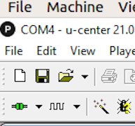
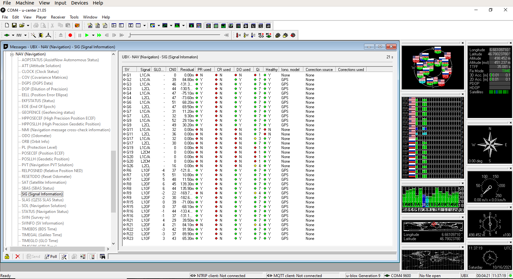

# Configuration de la station de base

## U-Center

U-center est le logiciel qui permet la configuration des modules u-blox, dont la carte simpleRTK2B. Ce logiciel est disponible uniquement pour Windows. Une solution pour l'utilisation de U-center est d'installer Wine. Wine permet de lancer des programmes prévu pour Windows sur Linux. La solution la plus simple reste d'utiliser une machine virtuelle Windows et d'y installer U-center.

## Mise à jour du firmware

Pour la mise à jour du firmware, suivre le tutoriel suivant :

- [Firmware Update](https://www.ardusimple.com/zed-f9p-firmware-update-with-simplertk2b/)

## Configuration

Avec un câble micro-usb to usb, brancher le micro-usb sur le port power+gps de la carte simpleRTK2B et l'usb sur l'ordinateur.

Ouvrir U-Center et choisir le bon port se connecter au module. Si une machine virtuelle est utilisée, être sur d'avoir ajouté le device.

Puis suivre les instructions fournies par le projet IKH : [xsens_imu_gps_rtk](https://github.com/ikh-innovation/xsens_imu_gps_rtk)

Dans u-center, ajouter quelques modifications à la configuration :
- Commencer par minimaliser la configuration afin d'éviter toute surcharge d'information
  - Laisser uniquement GPS et GLONASS comme constellations
- Essayer dans un premier temps de choisir le mode Survey-In (pour tester el fonctinnement) qui permet de mettre le temps souhaité d'attente et la précision souhaitée
  - Une précision trop petite peut engendrer des délais assez long pour l'obtention d'une position fixe
- Positionner l'antenne sur la position fixe (ou proche) afin que le module xsens soit en mesure de corriger la position

Vue du logiciel lorsque tout fonctionne correctement :

## Problèmes rencontrés

- Pas de réception de message RTCM sur le module xsens :
    Après un rendez-vous avec Monsieur Guillaume, plusieurs tests ont été effectués. Dans un premier temps, une vérification de la sortie radio a été faite, elle ne montre aucune activité. Ensuite un teste de la configuration du module gnss a été faite, elle montre que tout est configuré corretcement. Les leds de validations sont allumées pour GPS_fix et GPS>XBEE mais rien ne semble sortir sur l'uart2 comme configuré. L'oscilloscope ne montre pas d'activité. Finalement le problème venait de l'écart trop important avec la valeur fixe fournie.

Le kit RTKlib pour Windows met a disposition plusieurs outils gratuits pour la vérification de transmission de message :

- [RTKLib](https://github.com/tomojitakasu/RTKLIB_bin/archive/refs/heads/rtklib_2.4.3.zip)

## Sources

- [I Know How](https://github.com/ikh-innovation/xsens_imu_gps_rtk)
- [Ardusimple](https://www.ardusimple.com/configuration-files/)

Chapitre 3.1.5.5 pour la configuration de la station de base
- [U-blox integration manual](https://www.u-blox.com/en/ubx-viewer/view/ZED-F9P_IntegrationManual_UBX-18010802?url=https%3A%2F%2Fwww.u-blox.com%2Fsites%2Fdefault%2Ffiles%2FZED-F9P_IntegrationManual_UBX-18010802.pdf)  (3.1.5.5 Stationary base operation)

Pour transformer facilement des coordonnées wgs84 long lat, alt] en wgs84 xyz
- [online converter](https://tool-online.com/en/coordinate-converter.php)
