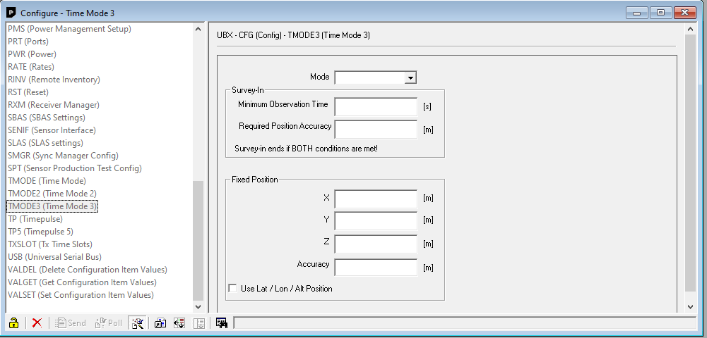

# Mesure statique

## Configuration de la station de base

Connecter la carte simpleRTK2B sur la machine hôte et ajouter le périphérique sur la machine virtuelle Windows10-REDS.

Lancer u-center et changer la position en utilisant la vue de configuration :

Utiliser le mode fixe et insérer la position WGS84 en mètre avec le plus de précision possible.

## Prise de mesure

Lancer MT Manager avec le xsens connecté à la machine hôte.

Dès que la correction est reçue commencer les mesures. La correction est reçue correctement lorsque le signal RTK est à 1.

Prendre des mesures à interval régulier.

