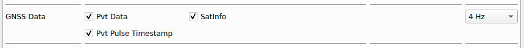
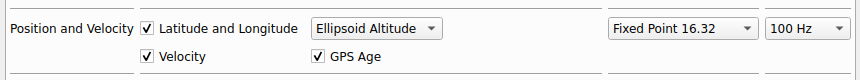

# Comparaison des mesures brutes GNSS VS mesures GNSS lissées - Xsens

Afin de prendre des mesures brutes de la sortie GNSS non modifiée, il faut aller dans MT manager pour configurer/ajouter la sortie de données GNSS data comme ci dessous :

Et enregistrer les modifications.

Afin de prendre des mesures brutes de la sortie GNSS lissée, il faut aller dans MT manager pour configurer/ajouter la sortie de données Position and Velocity comme ci dessous :

Et enregistrer les modifications.

Lancer le node xsens et comparer les valeurs reçues par gnss et filter/positionlla.

